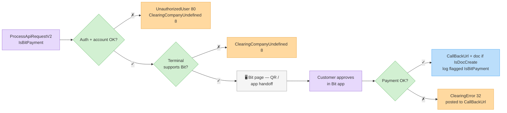
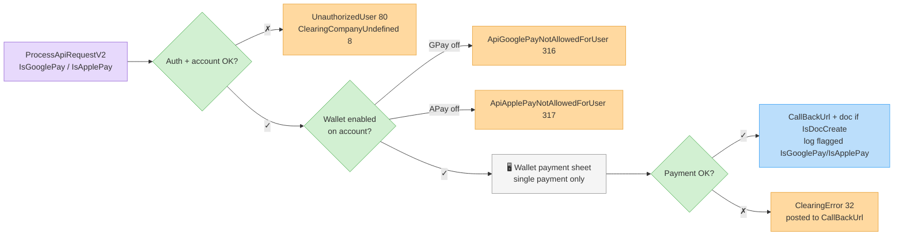

# Bit, Google Pay & Apple Pay

Alternative payment methods charged through the same [`ProcessApiRequestV2`](process-api-request-v2.md) endpoint, using dedicated flags. They differ from regular card clearing in enablement, vendor support and error behavior — treat them as a separate integration path.

## Request flags

Set exactly **one** of these on the clearing request:

| Field | Type | Description |
| ----- | ---- | ----------- |
| `IsBitPayment` | boolean | Charge via **Bit**. |
| `IsGooglePay` | boolean | Charge via **Google Pay**. |
| `IsApplePay` | boolean | Charge via **Apple Pay**. |

All other request fields work as in a [regular clearing request](process-api-request-v2.md) — `Sum`, customer details, `ReturnUrl`/`CallBackUrl`, `IsDocCreate`, etc.

## Example — Bit payment with auto document

```http
POST /Services/ApiService.svc/ProcessApiRequestV2 HTTP/1.1
Host: apiqa.invoice4u.co.il
Content-Type: application/json

{
  "request": {
    "Invoice4UUserApiKey": "<api-key>",
    "IsBitPayment": true,
    "Sum": 117.0,
    "FullName": "Israel Israeli",
    "Phone": "0501234567",
    "Email": "israel@example.com",
    "Description": "Order #10045",
    "IsDocCreate": true,
    "ReturnUrl": "https://shop.example/thanks",
    "CallBackUrl": "https://shop.example/api/i4u-callback",
    "IsQaMode": true
  }
}
```

The flow is the hosted-page flow: redirect the customer to the returned `ClearingRedirectUrl`, where they complete the payment in the wallet app / payment sheet.

## Flow — Bit



## Flow — Google Pay / Apple Pay



## Limitations

* **Account enablement required.** Google Pay and Apple Pay must be activated on your Invoice4U account — otherwise the request is rejected before reaching the provider (`ApiGooglePayNotAllowedForUser` 316 / `ApiApplePayNotAllowedForUser` 317).
* **Vendor support varies.** Not every clearing provider supports every wallet — availability depends on the clearing company and terminal configured on your account. Confirm with Invoice4U support which methods your terminal supports before integrating.
* **Hosted page only.** Wallet payments cannot be combined with `ChargeWithToken` — the customer must complete the payment interactively.
* **No installments.** Wallet charges are single-payment; `Type`/`PaymentsNum` installment options apply to card clearing only.
* Documents created for these charges record the payment with the matching payment type (e.g. Bit appears as payment type Bit/Other on the document), and the [clearing log](clearing-logs.md) rows carry the `IsBitPayment` / `IsGooglePay` / `IsApplePay` flags for reconciliation.

## Errors

| Error (ID) | Meaning |
| ---------- | ------- |
| `ApiGooglePayNotAllowedForUser` (316) | Google Pay not enabled on the account. |
| `ApiApplePayNotAllowedForUser` (317) | Apple Pay not enabled on the account. |
| `ClearingCompanyUndefined` (8) | No active clearing account, or the terminal doesn't support the requested method. |
| `ClearingError` (32) | Payment declined / provider error — details in `Paramters`. |
