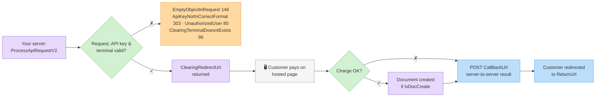

# Clearing Endpoints Overview

The clearing API charges credit cards (and Bit / Google Pay / Apple Pay) through the clearing account configured on your Invoice4U organization, and can automatically create the matching document.

### Supported clearing companies

The API works with the clearing provider configured on your account. The provider is identified by the `ClearingCompanies` enum — you'll see these values in [clearing logs](clearing-logs.md) (`ClearingCompany`):

| Value | Company | Value | Company |
| ----- | ------- | ----- | ------- |
| `1` | Tranzilla | `9` | TranzillaIframe |
| `2` | ZCredit | `10` | Payme |
| `3` | Pelecard | `11` | Isracard |
| `4` | ICreditInvoice4U | `12` | YaadSarig |
| `5` | ICreditUPay | `13` | Verifone |
| `6` | UPay | `14` | Paypal |
| `7` | Meshulam | `15` | Cardcom |
| `8` | VisaCal | | |


`ProcessApiRequestV2` routes hosted-page/token/standing-order/refund flows for **UPay (6), Meshulam (7), YaadSarig (12) and Cardcom (15)**. Other providers are served through the legacy clearing endpoints. The flow is identical from your side — the API routes to your provider.


### The hosted-page flow

Most charges use a hosted payment page:

1. Call [`ProcessApiRequestV2`](process-api-request-v2.md) with the amount, customer details and flags.
2. Redirect your customer to the returned `ClearingRedirectUrl`.
3. Invoice4U notifies your `CallBackUrl` and redirects the customer to your `ReturnUrl`.
4. If `IsDocCreate` was `true`, the document is created automatically after a successful charge.

**Token charges** (`ChargeWithToken`) and **refunds** (`Refund`) are server-to-server — no redirect; the result is returned synchronously.

### Variations

| Variation | Flag(s) | Page |
| --------- | ------- | ---- |
| Regular charge (hosted page) | — | [Process a Clearing Request (V2)](process-api-request-v2.md) |
| Charge with installments / credit | `Type` = 2/3 | [Process a Clearing Request (V2)](process-api-request-v2.md) |
| Bit / Google Pay / Apple Pay | `IsBitPayment` / `IsGooglePay` / `IsApplePay` | [Bit, Google Pay & Apple Pay](alternative-payment-methods.md) |
| Save card token only | `AddToken` | [Tokens & Standing Orders](tokens-and-standing-orders.md) |
| Save token + charge | `AddTokenAndCharge` | [Tokens & Standing Orders](tokens-and-standing-orders.md) |
| Charge saved token | `ChargeWithToken` | [Tokens & Standing Orders](tokens-and-standing-orders.md) |
| Standing order (recurring) | `IsStandingOrderClearance` | [Tokens & Standing Orders](tokens-and-standing-orders.md) |
| Refund | `Refund` | [Process a Clearing Request (V2)](process-api-request-v2.md#refunds) |
| Query charge history | — | [Clearing Logs](clearing-logs.md) |


`ProcessApiRequest` (V1) and the `ProcessApiRequestFullContents*` GET variants still work but are **legacy**. New integrations should use `ProcessApiRequestV2` only.


### Prerequisites

* A clearing account configured and active on your organization (`GetClearingAccount` returns it).
* For tokens / standing orders: the token / standing-order feature enabled on your clearing terminal (`ApiTokenizationNotApprovedInClearingTerminal` 309 / `ApiStandingOrderNotApprovedInClearingTerminal` 310 otherwise).
* For Bit / Google Pay / Apple Pay: see [Bit, Google Pay & Apple Pay](alternative-payment-methods.md) — wallet methods need account enablement and vendor support.
