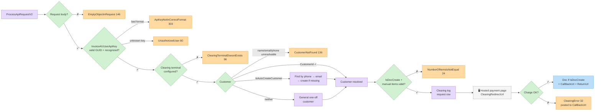
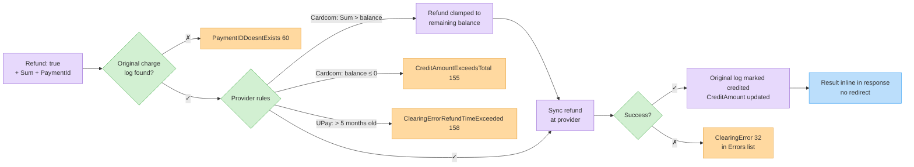

# Process a Clearing Request (V2)

The main clearing endpoint. Creates a hosted payment page, charges a saved token, or refunds a previous charge — and optionally creates the matching document.

## Endpoint

| | |
| - | - |
| **Method** | `POST` |
| **Path** | `/ProcessApiRequestV2` |
| **Response** | The same `ApiClearingRequest` object, enriched with results (`ClearingRedirectUrl`, `PaymentId`, `DocumentNumber`, …) — check `Errors` first |

## Flow — standard charge



## Request schema — `request` (ApiClearingRequest)

### Authentication

| Field | Type | Required | Description |
| ----- | ---- | -------- | ----------- |
| `Invoice4UUserApiKey` | string (GUID) | **Yes** | Your organization API key — required for clearing. |
| `Invoice4UUserEmail` + `Invoice4UUserPassword` | string | Legacy | Credential alternative for older integrations; new integrations must use the API key. |


Clearing requires an **active clearing account (terminal)** on your organization, and the customer identifiers below (`FullName`, `Phone`, `Email`) — they are used to authenticate the payer at the clearing terminal and for payment-page identification.


### Charge details

| Field | Type | Required | Description |
| ----- | ---- | -------- | ----------- |
| `Sum` | double | **Yes** | Amount to charge. |
| `Currency` | string | No | `"NIS"` (default), `"USD"`, `"EUR"`. |
| `Type` | int | No | `1` Regular (default), `2` Payments (installments), `3` CreditPayments, `4` Refund. |
| `PaymentsNum` | int | No | Number of installments when `Type` is 2/3. |
| `Description` | string | No | Charge description (shown on page/document). |
| `IsQaMode` | boolean | No | `true` when testing against QA. |
| `OrderIdClientUsage` | string | No | Your order reference, echoed back in callbacks. |
| `Platform` | string | No | Free-text platform identifier for your integration; recorded with the charge. |

Bit / Google Pay / Apple Pay charges use the `IsBitPayment` / `IsGooglePay` / `IsApplePay` flags — see [Bit, Google Pay & Apple Pay](alternative-payment-methods.md) for enablement, limitations and errors.

### Customer

| Field | Type | Required | Description |
| ----- | ---- | -------- | ----------- |
| `CustomerId` | int | Conditional | Existing customer. Its name/email/phone are used for the page and notifications. |
| `FullName` | string | **Yes** (without `CustomerId`) | Customer full name — used to authenticate the payer at the terminal. |
| `Phone` | string | **Yes** (without `CustomerId`) | Customer phone — payment-page SMS/identification. |
| `Email` | string | Recommended | Customer email — terminal identification and document delivery. |
| `IsAutoCreateCustomer` | boolean | No | Find-or-create a real customer record by phone/email; otherwise the charge uses a general customer. |
| `IsGeneralClient` | boolean | No (default `true`) | Document is issued to a general (one-off) customer. |

### Redirects & callbacks

| Field | Type | Required | Description |
| ----- | ---- | -------- | ----------- |
| `ReturnUrl` | string | Hosted page | Where the customer is redirected after payment. |
| `CallBackUrl` | string | Recommended | Server-to-server notification URL. |

### Document creation

| Field | Type | Required | Description |
| ----- | ---- | -------- | ----------- |
| `IsDocCreate` | boolean | No | Create a document automatically after a successful charge. |
| `DocHeadline` | string | No | Document subject (defaults to `Description`). |
| `IsManualDocCreationsWithParams` | boolean | No | Provide explicit line items via the pipe-separated `DocItem*` fields below. |
| `DocItemName` / `DocItemQuantity` / `DocItemPrice` | string | With manual items | Pipe-separated lists, equal length, e.g. `"Item A\|Item B"`, `"1\|2"`, `"100\|50"`. |
| `DocItemCode` / `DocItemTaxRate` | string | No | Optional pipe-separated code/VAT-rate lists. |
| `IsItemsBase64Encoded` | boolean | No | `DocItem*` values are Base64-encoded (for special characters). |
| `DocBranchId` | string | No | Branch for the document. |
| `DocComments` | string | No | Document comments. |
| `Language` / `DocLanguage` | string | No | Page / document language (`"he"` / `"en"`). |
| `TaxPercentage` | double | No | VAT override for the document. |

### Tokens, standing orders, refunds

See [Tokens & Standing Orders](tokens-and-standing-orders.md) for `AddToken`, `AddTokenAndCharge`, `ChargeWithToken`, `IsStandingOrderClearance`, `StandingOrderDuration`, `StandingOrderFirstChargeAmount`, `StandingOrderCallBackUrl` — and [Refunds](#refunds) below for `Refund` + `PaymentId`. `IsStandingOrderRequest` is reserved for internal use.

### Response-only fields

| Field | Type | Description |
| ----- | ---- | ----------- |
| `ClearingRedirectUrl` | string | Hosted payment page URL — redirect the customer here. |
| `PaymentId` | string | Provider payment reference — keep it for refunds. |
| `DocumentId` / `DocumentNumber` | GUID / long | The auto-created document (when `IsDocCreate`). |
| `CipherText` / `CipherTextOriginal` | string | Ciphers for the document view/print links. |

## Example request — hosted page + auto document

```http
POST /Services/ApiService.svc/ProcessApiRequestV2 HTTP/1.1
Host: apiqa.invoice4u.co.il
Content-Type: application/json

{
  "request": {
    "Invoice4UUserApiKey": "d2f1a6b3-1234-4c9a-9f00-1a2b3c4d5e6f",
    "Sum": 117.0,
    "Currency": "NIS",
    "Type": 1,
    "FullName": "Israel Israeli",
    "Phone": "0501234567",
    "Email": "israel@example.com",
    "Description": "Order #10045",
    "OrderIdClientUsage": "10045",
    "IsDocCreate": true,
    "DocHeadline": "Order #10045",
    "ReturnUrl": "https://shop.example/thanks",
    "CallBackUrl": "https://shop.example/api/i4u-callback",
    "IsQaMode": true
  }
}
```

## Example response

```json
{
  "ProcessApiRequestV2Result": {
    "Sum": 117.0,
    "OrderIdClientUsage": "10045",
    "ClearingRedirectUrl": "https://pay.example-provider.co.il/page/abc123",
    "PaymentId": "ab12cd34",
    "Errors": []
  }
}
```

Redirect the customer to `ClearingRedirectUrl`. After payment you receive the callback and, when `IsDocCreate` is set, the document fields (`DocumentId`, `DocumentNumber`, `CipherText`) are populated.

## Refunds

Set `Refund: true` and identify the original charge:

| Field | Type | Required | Description |
| ----- | ---- | -------- | ----------- |
| `Refund` | boolean | Yes | Refund mode. |
| `PaymentId` | string | Yes | Provider payment reference of the original charge — used to locate the clearing log (`PaymentIDDoesntExists`, 60, when not found). For UPay, `OrderIdClientUsage` is used as a fallback when empty. |
| `Sum` | double | Yes | Amount to refund. |

Refund behavior per provider (from the live implementation):

* **Cardcom** — the refund is validated against the remaining un-refunded balance: if `Sum` exceeds it, the refund is **clamped to the balance** (not rejected); if nothing is left to refund, `CreditAmountExceedsTotal` (155) is returned.
* **UPay** — refunds are possible up to **5 months** after the charge (`ClearingErrorRefundTimeExceeded`, 158).



## Common errors

| Error (ID) | Meaning |
| ---------- | ------- |
| `EmptyObjectInRequest` (146) | Request body missing. |
| `ApiKeyNotInCorrectFormat` (303) | `Invoice4UUserApiKey` is not a valid GUID. |
| `UnauthorizedUser` (80) | API key not recognized. |
| `ClearingTerminalDoesntExists` (96) | No clearing account, or the terminal for your provider is misconfigured (missing terminal/username/password). |
| `CustomerNotFound` (136) | `CustomerId` sent but name/email/phone could not be resolved. |
| `ApiBadRequestChargeMethodMustBeSelected` (319) | Conflicting flags (e.g. `AddTokenAndCharge` + `IsStandingOrderClearance`). |
| `ApiTokenizationNotApprovedInClearingTerminal` (309) | Token features not enabled on the terminal. |
| `ApiStandingOrderNotApprovedInClearingTerminal` (310) | Standing orders not enabled. |
| `ApiGooglePayNotAllowedForUser` (316) / `ApiApplePayNotAllowedForUser` (317) | Wallet method not enabled. |
| `ClientIDDoesntExists` (37) | `CustomerId` not found. |
| `NumberOfItemsIsNotEqual` (24) | `DocItem*` pipe-lists have different lengths. |
| `PaymentIDDoesntExists` (60) | Refund: original charge log not found for `PaymentId`. |
| `CreditAmountExceedsTotal` (155) | Refund: nothing left to refund on the original charge. |
| `ClearingError` (32) | Charge declined / provider error — details in `Paramters`. |
| `ClearingErrorRefundTimeExceeded` (158) | Refund window exceeded (UPay: 5 months). |

## Try it




