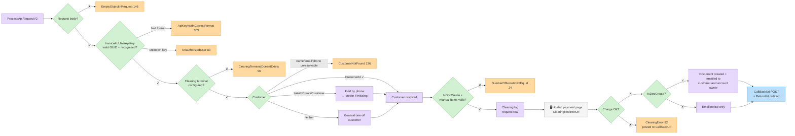
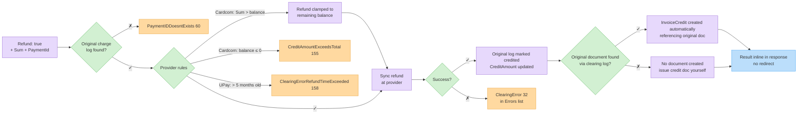

# Process a Clearing Request (V2)

The main clearing endpoint. Creates a hosted payment page, charges a saved token, or refunds a previous charge — and optionally creates the matching document.

## Endpoint

| | |
| - | - |
| **Method** | `POST` |
| **Path** | `/ProcessApiRequestV2` |
| **Response** | The same `ApiClearingRequest` object, enriched with results (`ClearingRedirectUrl`, `PaymentId`, `DocumentNumber`, …) — check `Errors` first |

## Flow — standard charge


```mermaid
flowchart LR
    classDef step fill:#E7D9FC,stroke:#9B6DD6,color:#333
    classDef dec fill:#D2F0D2,stroke:#4CAF50,color:#333
    classDef err fill:#FFD9A0,stroke:#E8A33D,color:#333
    classDef cb fill:#BBDEFB,stroke:#42A5F5,color:#333
    classDef page fill:#F5F5F5,stroke:#999,color:#333

    A[ProcessApiRequestV2]:::step --> B{Request body?}:::dec
    B -- ✗ --> E1[EmptyObjectInRequest 146]:::err
    B -- ✓ --> C{Invoice4UUserApiKey<br/>valid GUID + recognized?}:::dec
    C -- "bad format" --> E2a[ApiKeyNotInCorrectFormat 303]:::err
    C -- "unknown key" --> E2[UnauthorizedUser 80]:::err
    C -- ✓ --> D{Clearing terminal<br/>configured?}:::dec
    D -- ✗ --> E3[ClearingTerminalDoesntExists 96]:::err
    D -- ✓ --> F{Customer}:::dec
    F -- "name/email/phone unresolvable" --> E4[CustomerNotFound 136]:::err
    F -- "CustomerId ✓" --> H[Customer resolved]:::step
    F -- "IsAutoCreateCustomer" --> G[Find by phone<br/>→ create if missing]:::step --> H
    F -- "neither" --> G2[General one-off<br/>customer]:::step --> H
    H --> I{IsDocCreate +<br/>manual items valid?}:::dec
    I -- ✗ --> E5[NumberOfItemsIsNotEqual 24]:::err
    I -- ✓ --> J[Clearing log<br/>request row]:::step
    J --> K[🖥 Hosted payment page<br/>ClearingRedirectUrl]:::page
    K --> L{Charge OK?}:::dec
    L -- ✓ --> M{IsDocCreate?}:::dec
    M -- ✓ --> M1[Document created + emailed to<br/>customer and account owner]:::step
    M -- ✗ --> M2[Email notice only]:::step
    M1 --> O[CallBackUrl POST<br/>+ ReturnUrl redirect]:::cb
    M2 --> O
    L -- ✗ --> N[ClearingError 32<br/>posted to CallBackUrl]:::err
```

## Request schema — `request` (ApiClearingRequest)

### Authentication

| Field | Type | Required | Description |
| ----- | ---- | -------- | ----------- |
| `Invoice4UUserApiKey` | string (GUID) | **Yes** | Your organization API key — the only supported authentication for clearing. |


Clearing requires an **active clearing account (terminal)** on your organization, and the customer identifiers below (`FullName`, `Phone`, `Email`) — they are used to authenticate the payer at the clearing terminal and for payment-page identification.


The clearing provider is the one configured on your terminal — one of the supported companies (`ClearingCompanies`): **Cardcom (15)**, **UPay (6)** or **Meshulam (7)**. The request is identical for all of them; the API routes to your provider automatically based on your organization's configured clearing account.

### Charge details

| Field | Type | Required | Description |
| ----- | ---- | -------- | ----------- |
| `Sum` | double | **Yes** | Amount to charge. |
| `CreditCardCompanyType` | int | No | Optional card-company code copied onto the internal charge record when greater than 0. It does **not** select the clearing provider — the provider used is your organization's configured clearing account (Cardcom, UPay or Meshulam). Leave unset unless directed otherwise by Invoice4U support. |
| `Currency` | string | No | `"NIS"` (default; `"ILS"` accepted as an alias), `"USD"`, `"EUR"`. |
| `Type` | int | No | `1` Regular (default), `2` Payments (installments), `3` CreditPayments. `4` is internal and provider-specific — don't send it. To refund, use `Refund: true` + `PaymentId` (see [Refunds](#refunds)). |
| `PaymentsNum` | int | No | Number of installments when `Type` is 2/3. |
| `Description` | string | No | Charge description (shown on page/document). |
| `IsQaMode` | boolean | No | `true` when testing against QA. |
| `OrderIdClientUsage` | string | No | Your order reference, echoed back in callbacks. |
| `Platform` | string | No | Free-text platform identifier for your integration; recorded with the charge. |

Bit / Google Pay / Apple Pay charges use the `IsBitPayment` / `IsGooglePay` / `IsApplePay` flags — see [Bit, Google Pay & Apple Pay](alternative-payment-methods.md) for enablement, limitations and errors.

### Customer

| Field | Type | Required | Description |
| ----- | ---- | -------- | ----------- |
| `CustomerId` | int | Conditional | Existing customer. Its name/email/phone are used for the page and notifications. |
| `FullName` | string | **Yes** (without `CustomerId`) | Customer full name — used to authenticate the payer at the terminal. Not validated up front by the API; a missing value fails later at the clearing provider. |
| `Phone` | string | **Yes** (without `CustomerId`) | Customer phone — payment-page SMS/identification. Not validated up front by the API; a missing value fails later at the clearing provider. |
| `Email` | string | Recommended | Customer email — terminal identification and document delivery. |
| `IsAutoCreateCustomer` | boolean | No | Finds an existing customer by phone; if no match is found, creates a new customer record from `FullName`/`Phone`/`Email`. Matching by email alone is not currently supported — provide `Phone` for reliable matching. Without this flag, the charge uses a general (one-off) customer. |
| `IsGeneralClient` | boolean | No (default `true`) | Document is issued to a general (one-off) customer. |

### Redirects & callbacks

| Field | Type | Required | Description |
| ----- | ---- | -------- | ----------- |
| `ReturnUrl` | string | Hosted page | Where the customer is redirected after payment. |
| `CallBackUrl` | string | Recommended | Server-to-server notification URL. |

### Document creation

| Field | Type | Required | Description |
| ----- | ---- | -------- | ----------- |
| `IsDocCreate` | boolean | No | Create a document automatically after a successful charge. The document is emailed to both the customer and the account owner. |
| `DocHeadline` | string | No | Document subject (defaults to `Description`). |
| `IsManualDocCreationsWithParams` | boolean | No | Provide explicit line items via the pipe-separated `DocItem*` fields below. |
| `DocItemName` / `DocItemQuantity` / `DocItemPrice` | string | **With manual items** | Pipe-separated lists, equal length, e.g. `"Item A\|Item B"`, `"1\|2"`, `"100\|50"`. Missing/empty values return a clean API error (`DocumentItemMissingName` 39, `DocumentItemQuantityCannotBeZero` 40, `DocumentItemPriceCannotBeZero` 41). |
| `DocItemTaxRate` | string | **With manual items** | Pipe-separated VAT-rate list, same length as `DocItemQuantity`/`DocItemPrice` (empty entries per item are fine, e.g. `"|"`). Not validated up front — if the field is **omitted entirely** the request fails with an unhandled server error (500) instead of a clean API error; if the pipe-count doesn't match the other lists, the request fails the same way. Always send it whenever `IsManualDocCreationsWithParams` is `true`. |
| `DocItemCode` / `DocBranchId` | string | No | Accepted by the request but **not applied** to the created document in the current implementation — do not rely on them for item codes or branch assignment. |
| `IsItemsBase64Encoded` | boolean | No | **Not supported** — decoding is incomplete in the current implementation. Send `DocItem*` values as plain UTF-8 text, not Base64. |
| `DocComments` | string | No | Document comments. |
| `Language` / `DocLanguage` | string | No | Page / document language (`"he"` / `"en"`). |
| `TaxPercentage` | double | No | VAT override for the document. |


`DocItemTaxRate` is documented as optional but is **not null-checked** in the current implementation when `IsManualDocCreationsWithParams` is `true`. Omitting it, or sending fewer pipe-separated values than `DocItemQuantity`/`DocItemPrice`, throws an unhandled exception rather than returning an entry in `Errors` — always include it, matching the other lists' length, when creating documents with manual items.


### Tokens, standing orders, refunds

See [Saved-Card Tokens](tokens-and-standing-orders.md) for `AddToken`, `AddTokenAndCharge`, `ChargeWithToken`, and [Standing Orders](standing-orders.md) for `IsStandingOrderClearance`, `StandingOrderDuration`, `StandingOrderFirstChargeAmount`, `StandingOrderCallBackUrl` — and [Refunds](#refunds) below for `Refund` + `PaymentId`. `IsStandingOrderRequest` is reserved for internal use.

### Response-only fields

| Field | Type | Description |
| ----- | ---- | ----------- |
| `ClearingRedirectUrl` | string | Hosted payment page URL — redirect the customer here. |
| `PaymentId` | string | Provider payment reference — keep it for refunds. |
| `DocumentId` / `DocumentNumber` | GUID / long | The auto-created document (when `IsDocCreate`). |
| `CipherText` / `CipherTextOriginal` | string | Ciphers for the document view/print links. |

## Example request — hosted page + auto document

```http
POST /Services/ApiService.svc/ProcessApiRequestV2 HTTP/1.1
Host: apiqa.invoice4u.co.il
Content-Type: application/json

{
  "request": {
    "Invoice4UUserApiKey": "d2f1a6b3-1234-4c9a-9f00-1a2b3c4d5e6f",
    "Sum": 117.0,
    "Currency": "NIS",
    "Type": 1,
    "FullName": "Israel Israeli",
    "Phone": "0501234567",
    "Email": "israel@example.com",
    "Description": "Order #10045",
    "OrderIdClientUsage": "10045",
    "IsDocCreate": true,
    "DocHeadline": "Order #10045",
    "ReturnUrl": "https://shop.example/thanks",
    "CallBackUrl": "https://shop.example/api/i4u-callback",
    "IsQaMode": true
  }
}
```

## Example response

```json
{
  "d": {
    "Sum": 117.0,
    "OrderIdClientUsage": "10045",
    "ClearingRedirectUrl": "https://pay.example-provider.co.il/page/abc123",
    "PaymentId": "ab12cd34",
    "Errors": []
  }
}
```

Redirect the customer to `ClearingRedirectUrl`. After payment you receive the callback and, when `IsDocCreate` is set, the document fields (`DocumentId`, `DocumentNumber`, `CipherText`) are populated.

## Callback payload

After the customer completes the hosted page, Invoice4U POSTs the result to your `CallBackUrl` as a form field named `Data` containing a JSON object (i.e. the request body is `Data=<json>`). All values are strings (`"True"`/`"False"` for booleans):

```json
{
  "Success": "True",
  "TokenCaptureOnly": "False",
  "TokenCaptureAndCharge": "False",
  "ErrorMessage": "",
  "OrderIdClientUsage": "b2f0c9d4-0000-4000-8000-000000000001",
  "DocCreated": "True",
  "CardSuffix": "1234",
  "CardExpirationDate": "0828",
  "CardBrandName": "Visa",
  "UniqueId": "012345678",
  "Amount": "117",
  "AllPaymentsNum": "1",
  "CustomerId": "1234567",
  "CustomerName": "Israel Israeli",
  "CustomerMail": "israel@example.com",
  "CustomerPhone": "",
  "Description": "Order #10045",
  "AuthNumber": "0123456",
  "PaymentId": "100200300",
  "ClearingTraceId": "a1b2c3d4-0000-4000-8000-000000000002",
  "standingOrderId": "",
  "DocumentNumber": "70001",
  "DocumentId": "d4c3b2a1-0000-4000-8000-000000000003",
  "CipherText": "<url-encoded document view cipher>",
  "CipherTextOriginal": "<url-encoded original document cipher>"
}
```

| Field | Meaning |
| ----- | ------- |
| `Success` | `"True"` when the charge succeeded. On failure, `ErrorMessage` is populated. |
| `TokenCaptureOnly` / `TokenCaptureAndCharge` | Echo of the `AddToken` / `AddTokenAndCharge` flags. |
| `OrderIdClientUsage` | Your order reference from the request. |
| `DocCreated` | `"True"` when a document was auto-created (`IsDocCreate`). |
| `CardSuffix` / `CardExpirationDate` / `CardBrandName` | Charged card details (last 4 digits, `MMYY`, brand). |
| `UniqueId` | Payer identifier returned by the provider. |
| `Amount` / `AllPaymentsNum` | Charged amount and number of installments. |
| `CustomerId` / `CustomerName` / `CustomerMail` / `CustomerPhone` | Resolved customer. |
| `AuthNumber` | Clearing company approval number (also stored as `ClearingConfirmationNumber` in the clearing log). |
| `PaymentId` / `ClearingTraceId` | Provider payment ID and trace ID — use for refunds and log lookup. |
| `standingOrderId` | Populated for standing-order registrations — the new standing order's ID. Recurring charges use a different callback and format — see [Standing Orders](standing-orders.md#callbacks-which-one-when-and-what). |
| `DocumentNumber` / `DocumentId` / `CipherText` / `CipherTextOriginal` | Created document identifiers and URL-encoded view ciphers (build view links per [Create Document](../documents/create-document.md)). |


Validate the callback by looking up `PaymentId` / `ClearingTraceId` in your [clearing logs](clearing-logs.md) before fulfilling the order. If no callback arrives, treat the payment as not completed — the customer may have abandoned the page.


## Refunds

Set `Refund: true` and identify the original charge:

| Field | Type | Required | Description |
| ----- | ---- | -------- | ----------- |
| `Refund` | boolean | Yes | Refund mode. |
| `PaymentId` | string | Yes | Provider payment reference of the original charge — required for **every** refund, on every provider; used to locate the clearing log (`PaymentIDDoesntExists`, 60, when not found). |
| `Sum` | double | Yes | Amount to refund. |

Refund behavior per provider (from the live implementation):

* **Cardcom** — the refund is validated against the remaining un-refunded balance: if `Sum` exceeds it, the refund is **clamped to the balance** (not rejected); if nothing is left to refund, `CreditAmountExceedsTotal` (155) is returned.
* **UPay** — refunds are possible up to **5 months** after the charge (`ClearingErrorRefundTimeExceeded`, 158).
* **Meshulam** — no additional client-side limits; provider errors surface as `ClearingError` (32).

### Document creation on refunds

After a successful refund, a **credit invoice (InvoiceCredit) is created automatically** — but only when the original charge's document can be located through the clearing log (the charge was made with `IsDocCreate` and produced a document). The credit invoice references the original invoice receipt for the refunded amount and is emailed to the customer on record.

If no original document is found for the charge, **no document is created** — the refund itself still succeeds, and issuing a credit document is up to you (e.g. via [Create Document](../documents/create-document.md)). Check the refunded document's state after the call to confirm.


```mermaid
flowchart LR
    classDef step fill:#E7D9FC,stroke:#9B6DD6,color:#333
    classDef dec fill:#D2F0D2,stroke:#4CAF50,color:#333
    classDef err fill:#FFD9A0,stroke:#E8A33D,color:#333
    classDef cb fill:#BBDEFB,stroke:#42A5F5,color:#333

    A[Refund: true<br/>+ Sum + PaymentId]:::step --> B{Original charge<br/>log found?}:::dec
    B -- ✗ --> E1[PaymentIDDoesntExists 60]:::err
    B -- ✓ --> C{Provider rules}:::dec
    C -- "Cardcom: Sum > balance" --> C2[Refund clamped to<br/>remaining balance]:::step
    C2 --> D
    C -- "Cardcom: balance ≤ 0" --> E2[CreditAmountExceedsTotal 155]:::err
    C -- "UPay: > 5 months old" --> E3[ClearingErrorRefundTimeExceeded 158]:::err
    C -- ✓ --> D[Sync refund<br/>at provider]:::step
    D --> F{Success?}:::dec
    F -- ✓ --> G[Original log marked credited<br/>CreditAmount updated]:::step
    G --> I{Original document found<br/>via clearing log?}:::dec
    I -- ✓ --> J[InvoiceCredit created automatically<br/>referencing original doc]:::step
    I -- ✗ --> K[No document created<br/>issue credit doc yourself]:::step
    J --> H[Result inline in response<br/>no redirect]:::cb
    K --> H
    F -- ✗ --> E4[ClearingError 32<br/>in Errors list]:::err
```

## Common errors

| Error (ID) | Meaning |
| ---------- | ------- |
| `EmptyObjectInRequest` (146) | Request body missing. |
| `ApiKeyNotInCorrectFormat` (303) | `Invoice4UUserApiKey` is not a valid GUID. |
| `UnauthorizedUser` (80) | API key not recognized. |
| `ClearingTerminalDoesntExists` (96) | No clearing account, or the terminal for your provider is misconfigured (missing terminal/username/password). |
| `CustomerNotFound` (136) | `CustomerId` sent but name/email/phone could not be resolved. |
| `ApiBadRequestChargeMethodMustBeSelected` (319) | Conflicting flags (e.g. `AddTokenAndCharge` + `IsStandingOrderClearance`). |
| `ApiTokenizationNotApprovedInClearingTerminal` (309) | Token features not enabled on the terminal. |
| `ApiStandingOrderNotApprovedInClearingTerminal` (310) | Standing orders not enabled. |
| `ApiGooglePayNotAllowedForUser` (316) / `ApiApplePayNotAllowedForUser` (317) | Wallet method not enabled. |
| `DocumentItemMissingName` (39) | Manual items: `DocItemName` is empty. |
| `DocumentItemQuantityCannotBeZero` (40) | Manual items: `DocItemQuantity` is empty. |
| `DocumentItemPriceCannotBeZero` (41) | Manual items: `DocItemPrice` is empty. |
| `ItemsQuantityMustBeNumaric` (26) | Manual items: a `DocItemQuantity` entry isn't numeric. |
| `ItemsPriceMustBeNumaric` (25) | Manual items: a `DocItemPrice` entry isn't numeric. |
| `NumberOfItemsIsNotEqual` (24) | `DocItemName`/`DocItemQuantity`/`DocItemPrice` pipe-lists have different lengths. Note: this check does **not** cover `DocItemTaxRate` — a mismatched or missing `DocItemTaxRate` throws an unhandled exception instead (see warning above). |
| `PaymentIDDoesntExists` (60) | Refund: original charge log not found for `PaymentId`. |
| `CreditAmountExceedsTotal` (155) | Refund: nothing left to refund on the original charge. |
| `ClearingError` (32) | Charge declined / provider error — details in `Paramters`. |
| `ClearingErrorRefundTimeExceeded` (158) | Refund window exceeded (UPay: 5 months). |
| `ApiChargeAttemptPhoneInvalid` (314) | `AddToken`/`AddTokenAndCharge` (Meshulam, Cardcom): the hosted card-capture page failed, often due to invalid phone/customer data — see [Saved-Card Tokens](tokens-and-standing-orders.md). |

## Try it




