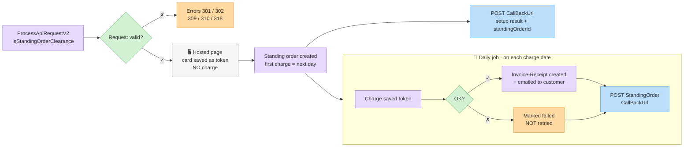

# Standing Orders (Recurring Charges)

A **standing order** charges a customer's saved card automatically every month, for a fixed number of months, and issues an Invoice-Receipt for every successful charge. You create it with a single [`ProcessApiRequestV2`](process-api-request-v2.md) call; after that, Invoice4U runs the schedule for you.

This page applies to **Cardcom (15)**, **Meshulam (7)** and **UPay (6)** terminals. Where UPay behaves differently it is called out — see [UPay differences](#upay-differences).


**Prerequisites:** an active clearing account with **both** tokens and standing orders enabled (and not expired) on the terminal. Otherwise the request fails with `ApiTokenizationNotApprovedInClearingTerminal` (309) / `ApiStandingOrderNotApprovedInClearingTerminal` (310). The scheduled charges also only run while both features are enabled on the terminal.


## Lifecycle at a glance



1. **Setup** — your server calls `ProcessApiRequestV2` with `IsStandingOrderClearance: true` and redirects the customer to `ClearingRedirectUrl`. The request is processed as a **token-creation** transaction: the hosted page only **saves the card**, the customer is **not charged** on this page.
2. **Standing order created** — Invoice4U creates the standing order and its monthly charge dates, then posts the setup result to your `CallBackUrl` once, in the regular [clearing callback](process-api-request-v2.md#callback-payload) format with `standingOrderId` filled in.
3. **Recurring charges** — the standing-order job charges every standing order whose charge date is **today**, creates the document, and posts the result of each attempt — success **or** failure — to `StandingOrderCallBackUrl`.
4. **End** — after `StandingOrderDuration` charge dates the standing order is complete. Failed charge dates are not made up (see [Failed charges](#failed-charges-no-automatic-retries)).

## Create a standing order

`POST /Services/ApiService.svc/ProcessApiRequestV2` with the usual [clearing fields](process-api-request-v2.md#request-schema-request-apiclearingrequest) plus:

| Field | Type | Required | Description |
| ----- | ---- | -------- | ----------- |
| `IsStandingOrderClearance` | boolean | **Yes** | Standing-order mode. Turns the request into a card-capture (token) page. Cannot be combined with `AddTokenAndCharge` (`ApiBadRequestChargeMethodMustBeSelected`, 319). |
| `Sum` | double | **Yes** | The **monthly** amount (VAT included). |
| `StandingOrderDuration` | int | **Yes** | Number of monthly charges, must be > 0 (`ApiStandingOrderDurationNotFilled`, 301). At most **120** charge dates are created, even if you send a larger number. |
| `DocHeadline` | string | **Yes** | Subject — and line-item name — of every recurring document (`ApiStandingOrderDocSubjectNotFilled`, 302). |
| `StandingOrderFirstChargeAmount` | double | No | A different amount for the **first** scheduled charge only (e.g. a setup fee or a discounted first month). Subsequent charges use `Sum`. |
| `StandingOrderCallBackUrl` | string | Recommended | Your endpoint for **recurring-charge** notifications (Cardcom / Meshulam — see [UPay differences](#upay-differences)). Must be a well-formed absolute URL (`ApiStandingOrderCallbackurlInvalid`, 318). A value without a scheme gets `http://` prepended (`https://` when it starts with `www`). See [format](#recurring-charge-callback-standingordercallbackurl). |
| `CallBackUrl` | string | Recommended | Your endpoint for the **one-time setup** result. |
| `ReturnUrl` | string | Yes | Where the customer's browser returns after the card page. |
| `CustomerId` / `IsAutoCreateCustomer` | int / boolean | Recommended | The saved token and the standing order are attached to the resolved customer; each recurring document is issued to that customer and emailed to the addresses on its customer card. |
| `FullName` / `Phone` / `Email` | string | **Yes** (without `CustomerId`) | Payer details, as for any hosted-page request. |
| `CreditCardCompanyType` | int | **Yes** | Your provider: `6` UPay, `7` Meshulam, `15` Cardcom. |


* **Don't send** `Type` = 2/3 or `PaymentsNum` > 1 — installments change the transaction type from token creation to an installments transaction.
* **Don't send** `IsDocCreate`. Documents are created by the recurring charges regardless; at setup nothing is charged.
* `Currency` is ignored — standing orders created through the API are always charged in **ILS**.


### Example request

```http
POST /Services/ApiService.svc/ProcessApiRequestV2 HTTP/1.1
Host: apiqa.invoice4u.co.il
Content-Type: application/json

{
  "request": {
    "Invoice4UUserApiKey": "d2f1a6b3-1234-4c9a-9f00-1a2b3c4d5e6f",
    "CreditCardCompanyType": 7,
    "IsStandingOrderClearance": true,
    "Sum": 99.0,
    "StandingOrderDuration": 12,
    "StandingOrderFirstChargeAmount": 49.0,
    "DocHeadline": "Pro plan subscription",
    "CustomerId": 88231,
    "FullName": "Israel Israeli",
    "Phone": "0501234567",
    "Email": "israel@example.com",
    "OrderIdClientUsage": "sub-10045",
    "ReturnUrl": "https://shop.example/subscribed",
    "CallBackUrl": "https://shop.example/api/i4u-callback",
    "StandingOrderCallBackUrl": "https://shop.example/api/i4u-recurring",
    "IsQaMode": true
  }
}
```

The response is the same as for any hosted-page request — check `Errors`, then redirect the customer to `ClearingRedirectUrl`:

```json
{
  "ProcessApiRequestV2Result": {
    "Sum": 99.0,
    "OrderIdClientUsage": "sub-10045",
    "ClearingRedirectUrl": "https://pay.example-provider.co.il/page/abc123",
    "Errors": []
  }
}
```

## Charge schedule

| Rule | Behavior |
| ---- | -------- |
| First charge | The **day after** the standing order is created (i.e. the day after the customer completes the card page). Nothing is charged on the day of sign-up. |
| Following charges | Monthly, on the same day of the month as the first charge. |
| Short months | A first charge on the 29th–31st falls on the last day of shorter months, and returns to the original day afterwards (e.g. 31 Jan → 28 Feb → 31 Mar → 30 Apr). |
| Number of charges | `StandingOrderDuration` charge dates, at most 120. |
| When in the day | The standing-order job runs **every day, including weekends, starting at 08:00 Israel time**. On most days it finishes within about an hour; on busy charge days (e.g. the 1st, 10th and 15th of the month) charges can run until around 13:00. Don't depend on an exact time. |

Example: a customer completes the card page on **15 March 2026** with `StandingOrderDuration: 12` → charge dates 16 Mar 2026, 16 Apr, 16 May … 16 Feb 2027.

## Amounts

* **First charge:** `StandingOrderFirstChargeAmount` when it is sent and differs from `Sum`; otherwise `Sum`.
* **Every other charge:** `Sum`.
* Amounts are VAT-inclusive; the document's VAT is calculated from your organization's VAT rate.

## What happens on each charge

On every charge date, the standing-order job:

1. Charges the customer's **current** saved token (looked up by customer and clearing company at charge time — see [Replacing the card](#replacing-the-card)).
2. On success, creates an **Invoice-Receipt**: subject and line item = `DocHeadline`, at the charged amount, with a credit-card payment line. The charge also appears in your [clearing logs](clearing-logs.md), and the document is linked to that clearing-log entry.
3. Emails the document to the customer's email address(es) on the customer card. The account owner is not copied by default; this can be switched on per standing order (**Send the invoices to my email**) in the Invoice4U web app.
4. Records the result (success or failure) in the standing order's charge history.
5. Posts the [recurring-charge callback](#recurring-charge-callback-standingordercallbackurl), if a callback URL is stored on the standing order.

After processing an organization's charges, the job also emails the **account owner a summary** of that run's standing-order charges and their results.


Every document created by a standing order carries `ApiIdentifier` = `SO_<standingOrderId>`. The identifier is the same for all charges of that standing order, so use [Search Documents](../documents/search-documents.md) (by customer and date) to find a specific month's document.


## Callbacks — which one, when, and what

A standing order uses **two different callbacks** with **different formats**:

| | Setup callback | Recurring-charge callback |
| - | -------------- | ------------------------- |
| **URL** | `CallBackUrl` | `StandingOrderCallBackUrl` (UPay: `CallBackUrl` — see [UPay differences](#upay-differences)) |
| **When** | Once, after the card page is completed and the standing order is created | After **every** scheduled charge attempt — success or failure |
| **How often** | 1 per standing order | Up to `StandingOrderDuration` times (one per charge date) |
| **Method / Content-Type** | `POST`, `application/x-www-form-urlencoded` | `POST`, `application/x-www-form-urlencoded` (header only — see below) |
| **Body** | Form field `Data` = JSON (PascalCase keys) | **Raw Base64 string** of a JSON object (camelCase keys) — no field name |
| **Identifies the standing order by** | `standingOrderId` | `standingOrderId` |
| **Includes document details** | No (no document is created at setup) | Only `isSuccessDocCreation` — no document number or ID |
| **Includes `PaymentId` / `OrderIdClientUsage`** | Yes | No |


Store the **`standingOrderId`** from the setup callback against your subscription record. It is the only link between the recurring-charge callbacks and your system — `OrderIdClientUsage` is **not** included in the recurring-charge callbacks.


### Setup callback (`CallBackUrl`)

Sent once, only after the standing order was created. It uses the regular [clearing callback format](process-api-request-v2.md#callback-payload) — a form field named `Data` containing JSON, all values strings — with the same fields. What's specific to a standing order:

* `standingOrderId` — the new standing order's ID. **Save it.**
* `DocCreated` — `"False"`; no document is created at setup.
* `CardSuffix` / `CardExpirationDate` / `CardBrandName` — the saved card.
* The token flags (`TokenCaptureOnly` / `TokenCaptureAndCharge`) differ by provider — don't use them to recognize a standing-order sign-up.

```text
POST /api/i4u-callback HTTP/1.1
Host: shop.example
Content-Type: application/x-www-form-urlencoded

Data={
  "Success": "True",
  "TokenCaptureOnly": "<True|False>",
  "TokenCaptureAndCharge": "False",
  "ErrorMessage": "",
  "OrderIdClientUsage": "sub-10045",
  "DocCreated": "False",
  "CardSuffix": "1234",
  "CardExpirationDate": "0828",
  "CardBrandName": "Visa",
  "UniqueId": "012345678",
  "Amount": "99",
  "AllPaymentsNum": "1",
  "CustomerId": "88231",
  "CustomerName": "Israel Israeli",
  "CustomerMail": "israel@example.com",
  "CustomerPhone": "0501234567",
  "Description": "",
  "AuthNumber": "<provider value>",
  "PaymentId": "<provider value>",
  "ClearingTraceId": "<provider value>",
  "standingOrderId": "150877"
}
```

If the setup callback doesn't arrive, or arrives without a `standingOrderId` on a Cardcom / Meshulam terminal, treat the sign-up as **not** completed.

### Recurring-charge callback (`StandingOrderCallBackUrl`)

Sent after each scheduled charge attempt, after the document step. The request body is **not** a form field and **not** JSON: it is the Base64 encoding of a UTF-8 JSON object, sent as the raw body.

```http
POST /api/i4u-recurring HTTP/1.1
Host: shop.example
Content-Type: application/x-www-form-urlencoded

ew0KICAic3VtIjogIjk5IiwNCiAgInBheW1lbnRzTnVtIjogIjk5IiwNCiAgIm93bmVySWQiOiAiMDEyMzQ1Njc4IiwNCiAgImNhcmRTdWZmaXgiOiAiMTIzNCIsDQogICJjYXJkRXhwRGF0ZSI6ICIwODI4IiwNCiAgImNsaWVudE5hbWUiOiAiSXNyYWVsIElzcmFlbGkiLA0KICAiY2xpZW50UGhvbmUiOiAiMDUwMTIzNDU2NyIsDQogICJjbGllbnRFbWFpbCI6ICJpc3JhZWxAZXhhbXBsZS5jb20iLA0KICAic3RhbmRpbmdPcmRlcklkIjogIjE1MDg3NyIsDQogICJpc1N1Y2Nlc3NDbGVhcmluZyI6ICJ0cnVlIiwNCiAgImlzU3VjY2Vzc0RvY0NyZWF0aW9uIjogInRydWUiLA0KICAiZmFpbHVyZUNsZWFyaW5nTWVzc2FnZSI6ICIiLA0KICAiZmFpbHVyZURvY0NyZWF0aW9uTWVzc2FnZSI6ICIiDQp9
```

Decoded:

```json
{
  "sum": "99",
  "paymentsNum": "99",
  "ownerId": "012345678",
  "cardSuffix": "1234",
  "cardExpDate": "0828",
  "clientName": "Israel Israeli",
  "clientPhone": "0501234567",
  "clientEmail": "israel@example.com",
  "standingOrderId": "150877",
  "isSuccessClearing": "true",
  "isSuccessDocCreation": "true",
  "failureClearingMessage": "",
  "failureDocCreationMessage": ""
}
```

A failed charge has the same shape, with `isSuccessClearing: "false"`, `isSuccessDocCreation: "false"` and the reasons in the two message fields:

```json
{
  "sum": "99",
  "paymentsNum": "99",
  "ownerId": "012345678",
  "cardSuffix": "1234",
  "cardExpDate": "0828",
  "clientName": "Israel Israeli",
  "clientPhone": "0501234567",
  "clientEmail": "israel@example.com",
  "standingOrderId": "150877",
  "isSuccessClearing": "false",
  "isSuccessDocCreation": "false",
  "failureClearingMessage": "<decline reason from the clearing company>",
  "failureDocCreationMessage": "המסמך לא הופק עקב כישלון בסליקה"
}
```

| Field | Meaning |
| ----- | ------- |
| `standingOrderId` | The standing order this charge belongs to — match it to the ID saved from the setup callback. |
| `isSuccessClearing` | `"true"` when the card was charged. This is the field that decides whether the month was paid. |
| `isSuccessDocCreation` | `"true"` when the Invoice-Receipt was created. Can be `"false"` even after a successful charge — the money was collected but the document needs attention (see `failureDocCreationMessage`). |
| `failureClearingMessage` | Decline / error reason when `isSuccessClearing` is `"false"`. Free text from the clearing company or Invoice4U, usually in **Hebrew** (for example `חברת האשראי לא אשרה את העסקה`, `כרטיס פג תוקף.`, `כרטיס חסום - עסקה לא מאושרת`) — log it, don't parse it. When the customer has no saved token it is `לא מוגדר טוקן עבור הלקוח - לא התבצע נסיון חיוב` ("no token defined for the customer — no charge attempted"). |
| `failureDocCreationMessage` | Reason the document was not created. Free text, often Hebrew. After a failed charge it is `המסמך לא הופק עקב כישלון בסליקה` ("document not issued because the charge failed"). |
| `sum` | The standing order's regular monthly amount (`Sum`). On a first charge with `StandingOrderFirstChargeAmount`, the amount actually charged differs from this value. |
| `paymentsNum` | Currently carries the same value as `sum` — don't rely on it. Each scheduled charge is a single payment. |
| `ownerId` | Card owner's ID number, as saved with the token. |
| `cardSuffix` / `cardExpDate` | The saved card's last digits and expiry, as stored with the token. |
| `clientName` / `clientPhone` / `clientEmail` | The customer card's current name, mobile and email. |

All values are strings. The callback does **not** include the charge date, the amount actually charged, a `PaymentId`, or the document number — use the day you received it as the charge date, and look documents up with [Search Documents](../documents/search-documents.md).

#### Reading the body

Read the **raw request body** and Base64-decode it. Don't let a form parser read it: Base64 may contain `+`, `/` and `=`, and form decoding turns `+` into a space and corrupts the payload.



```javascript
app.post('/api/i4u-recurring', express.text({ type: '*/*' }), (req, res) => {
  const evt = JSON.parse(Buffer.from(req.body.trim(), 'base64').toString('utf8'));

  if (evt.isSuccessClearing === 'true') {
    markMonthPaid(evt.standingOrderId);
  } else {
    handleFailedCharge(evt.standingOrderId, evt.failureClearingMessage);
  }
  res.sendStatus(200);
});
```



```php
<?php
$raw = trim(file_get_contents('php://input'));   // not $_POST
$evt = json_decode(base64_decode($raw), true);

if ($evt['isSuccessClearing'] === 'true') {
    markMonthPaid($evt['standingOrderId']);
} else {
    handleFailedCharge($evt['standingOrderId'], $evt['failureClearingMessage']);
}
http_response_code(200);
```



```csharp
app.MapPost("/api/i4u-recurring", async (HttpRequest req) =>
{
    using var reader = new StreamReader(req.Body);
    var raw = (await reader.ReadToEndAsync()).Trim();
    var json = Encoding.UTF8.GetString(Convert.FromBase64String(raw));
    var evt = JsonSerializer.Deserialize<Dictionary<string, string>>(json)!;

    if (evt["isSuccessClearing"] == "true") MarkMonthPaid(evt["standingOrderId"]);
    else HandleFailedCharge(evt["standingOrderId"], evt["failureClearingMessage"]);

    return Results.Ok();
});
```



To test your endpoint, post the sample body above:

```bash
curl -X POST "https://shop.example/api/i4u-recurring" \
  -H "Content-Type: application/x-www-form-urlencoded" \
  --data-binary "ew0KICAic3VtIjogIjk5IiwNCiAgInBheW1lbnRzTnVtIjogIjk5IiwNCiAgIm93bmVySWQiOiAiMDEyMzQ1Njc4IiwNCiAgImNhcmRTdWZmaXgiOiAiMTIzNCIsDQogICJjYXJkRXhwRGF0ZSI6ICIwODI4IiwNCiAgImNsaWVudE5hbWUiOiAiSXNyYWVsIElzcmFlbGkiLA0KICAiY2xpZW50UGhvbmUiOiAiMDUwMTIzNDU2NyIsDQogICJjbGllbnRFbWFpbCI6ICJpc3JhZWxAZXhhbXBsZS5jb20iLA0KICAic3RhbmRpbmdPcmRlcklkIjogIjE1MDg3NyIsDQogICJpc1N1Y2Nlc3NDbGVhcmluZyI6ICJ0cnVlIiwNCiAgImlzU3VjY2Vzc0RvY0NyZWF0aW9uIjogInRydWUiLA0KICAiZmFpbHVyZUNsZWFyaW5nTWVzc2FnZSI6ICIiLA0KICAiZmFpbHVyZURvY0NyZWF0aW9uTWVzc2FnZSI6ICIiDQp9"
```

#### Delivery rules

* **One attempt, no retries.** The callback is posted once per charge attempt. If your endpoint is down or errors, the notification is lost. Your response status and body are ignored.
* **Query strings are dropped.** The callback is posted to the scheme, host and path of the stored URL only — parameters such as `?tenant=42` are **not** sent. Put anything you need to route the call into the **path** (e.g. `/api/i4u-recurring/42`).
* **Not signed.** There is no signature or secret. Treat the callback as a notification: check `standingOrderId` against your records, and use a hard-to-guess path.
* **Idempotency.** Key your processing on `standingOrderId` + the date received, so a duplicate delivery can't double-count a month.
* **Not sent** when no token record exists at all for the standing order's customer.
* **TLS:** HTTPS endpoints must support TLS 1.1 or 1.2.

## Failed charges (no automatic retries)


**A failed recurring charge is not retried.** When a charge is declined (or no card is saved), that charge date is recorded as failed, the recurring-charge callback is sent with `isSuccessClearing: "false"`, and **nothing further happens for that month**. The standing order stays active and the **next** month's charge runs as scheduled.

Production data confirms this: of the standing-order charges that failed in a recent three-month period, none were charged again automatically.


What this means for your integration:

* `isSuccessClearing: "false"` is final for that month — don't wait for a later success callback.
* To recover the missed amount, contact the customer and either:
  * collect a new card with [`AddToken`](tokens-and-standing-orders.md#save-a-token-addtoken) for the same `CustomerId` (this also updates the card for future months — see below), then charge the missed amount with [`ChargeWithToken`](tokens-and-standing-orders.md#charge-a-saved-token-chargewithtoken) and `IsDocCreate: true`; or
  * charge it through a regular [hosted-page request](process-api-request-v2.md).
* Charges you make yourself this way are **not** linked to the standing order: they don't change its charge history and don't trigger a recurring-charge callback.

## Replacing the card

A customer has at most one saved token: saving a new card for a customer deletes the previous token. Because the job looks up the customer's token at charge time, all **future** charges of that customer's standing orders use the new card automatically — there's no need to recreate the standing order.

## Managing and cancelling

The public API creates standing orders but does not expose update or cancel operations. To deactivate, delete, change the amount or dates, or view a standing order's charge history, use the Standing Orders screen in the Invoice4U web app. Inactive or deleted standing orders are not charged.

## UPay differences

On **UPay** terminals standing orders differ from Cardcom / Meshulam in three ways:

* **Recurring-charge callbacks go to `CallBackUrl`.** `StandingOrderCallBackUrl` is not stored on UPay standing orders; the request's `CallBackUrl` is stored instead. Your `CallBackUrl` endpoint therefore receives **both** formats — the one-time `Data=` setup callback and the monthly raw-Base64 callbacks — and must tell them apart (a body starting with `Data=` is the setup callback). Without a `CallBackUrl`, no recurring-charge callbacks are sent at all.
* **The setup callback has no `standingOrderId`.** Match the recurring callbacks' `standingOrderId` to your subscription by customer (`clientEmail` / `clientPhone` / `clientName`) on the first recurring callback, then store it. A UPay setup callback looks like this (`TokenCaptureOnly` is `"True"`, `standingOrderId` is empty):

  ```text
  Data={
    "Success": "True",
    "TokenCaptureOnly": "True",
    "TokenCaptureAndCharge": "False",
    "ErrorMessage": "",
    "OrderIdClientUsage": "sub-10045",
    "DocCreated": "False",
    "CardSuffix": "1234",
    "CardExpirationDate": "0828",
    "CardBrandName": "",
    "UniqueId": "012345678",
    "Amount": "1",
    "AllPaymentsNum": "1",
    "CustomerId": "88231",
    "CustomerName": "Client Name",
    "CustomerMail": "client@acme.test",
    "CustomerPhone": "0500000000",
    "Description": "",
    "AuthNumber": "",
    "PaymentId": "",
    "ClearingTraceId": "a1b2c3d4-0000-4000-8000-000000000002",
    "standingOrderId": ""
  }
  ```
* **A successful clearing-log entry is written at sign-up.** It carries the monthly `Sum` as `Amount` and `IsToken: true`, although nothing was charged. Don't count it as a payment in your reconciliation — the first real charge is the next day.

## FAQ

**Is the customer charged when they enter their card?**
No. The sign-up page only saves the card. The first charge is on the next day's charge date.

**Can I take the first payment immediately at sign-up?**
Not on the standing-order page — `AddTokenAndCharge` can't be combined with `IsStandingOrderClearance`. The first scheduled charge is always the day after sign-up.

**How do I know a month was paid?**
From the recurring-charge callback (`isSuccessClearing`), the customer's documents ([Search Documents](../documents/search-documents.md)), or your [clearing logs](clearing-logs.md).

**I didn't receive a recurring-charge callback.**
Check that the callback URL was set (on UPay: `CallBackUrl`), that the endpoint was reachable at the time (there's no retry), and that it doesn't depend on query-string parameters. Then check the customer's documents or the charge history in the web app.

**Why does the decline message look like Hebrew?**
Decline and document messages are free text from the clearing company or Invoice4U. Log them for support; branch your logic only on `isSuccessClearing` / `isSuccessDocCreation`.

**Can a standing order run forever?**
No. At most 120 monthly charge dates are created. To continue after it ends, create a new standing order.

## Errors

| Error (ID) | Meaning |
| ---------- | ------- |
| `ApiStandingOrderDurationNotFilled` (301) | `StandingOrderDuration` missing or ≤ 0. |
| `ApiStandingOrderDocSubjectNotFilled` (302) | `DocHeadline` missing. |
| `ApiStandingOrderCallbackurlInvalid` (318) | `StandingOrderCallBackUrl` isn't a well-formed URL. |
| `ApiStandingOrderNotApprovedInClearingTerminal` (310) | Standing orders not enabled (or expired) on the terminal. |
| `ApiTokenizationNotApprovedInClearingTerminal` (309) | Tokens not enabled (or expired) on the terminal. |
| `ApiBadRequestChargeMethodMustBeSelected` (319) | Conflicting flags, e.g. `AddTokenAndCharge` + `IsStandingOrderClearance`. |
