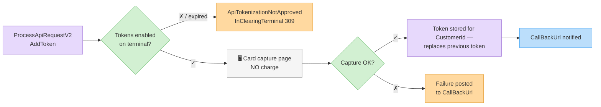
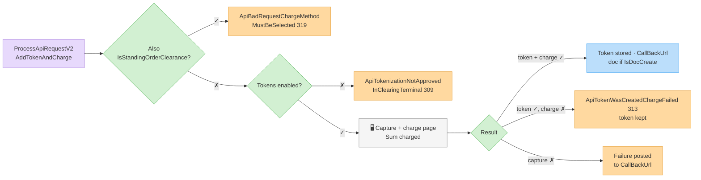
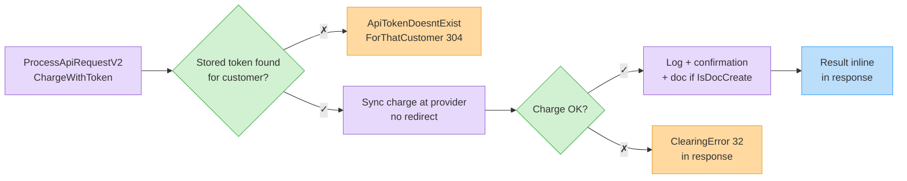
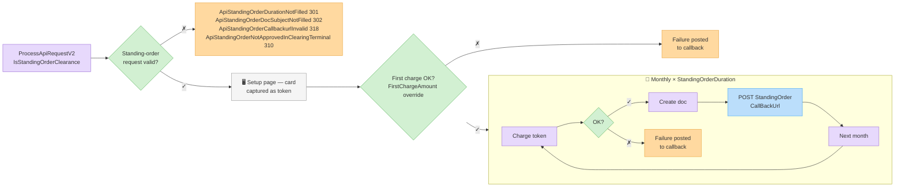

# Tokens & Standing Orders

Save a customer's card as a **token** for later server-side charges, or set up a **standing order** (recurring monthly charge). All flows go through [`ProcessApiRequestV2`](process-api-request-v2.md) with the flags below.


Tokens and standing orders must be enabled on your clearing terminal. Otherwise you get `ApiTokenizationNotApprovedInClearingTerminal` (309) / `ApiStandingOrderNotApprovedInClearingTerminal` (310).


## Save a token — `AddToken`

Opens a hosted page that captures the card and stores a token, **without charging**.

```json
{
  "request": {
    "Invoice4UUserApiKey": "<api-key>",
    "AddToken": true,
    "FullName": "Israel Israeli",
    "Phone": "0501234567",
    "Email": "israel@example.com",
    "CustomerId": 88231,
    "ReturnUrl": "https://shop.example/card-saved",
    "CallBackUrl": "https://shop.example/api/i4u-callback"
  }
}
```

Redirect the customer to the returned `ClearingRedirectUrl`. The token is stored against the customer (`CustomerId` recommended so the token is retrievable later).



## Save + charge — `AddTokenAndCharge`

Same as above but also charges `Sum` immediately. Cannot be combined with `IsStandingOrderClearance` (`ApiBadRequestChargeMethodMustBeSelected`, 319).



## Charge a saved token — `ChargeWithToken`

Server-to-server, synchronous — no redirect:

```json
{
  "request": {
    "Invoice4UUserApiKey": "<api-key>",
    "ChargeWithToken": true,
    "CustomerId": 88231,
    "Sum": 117.0,
    "Description": "Monthly subscription - July",
    "IsDocCreate": true,
    "DocHeadline": "Monthly subscription - July"
  }
}
```

The stored token for the customer is resolved automatically. A stored token must exist for the customer — otherwise `ApiTokenDoesntExistForThatCustomer` (304). Saving a new card for the customer **replaces** the previous token, so at most one token is kept per customer. On success the response carries the confirmation and, with `IsDocCreate`, the created document fields. If the token was created but a follow-up charge failed: `ApiTokenWasCreatedChargeFailed` (313).



## Standing order — `IsStandingOrderClearance`

Sets up a recurring monthly charge via the hosted page:

| Field | Type | Required | Description |
| ----- | ---- | -------- | ----------- |
| `IsStandingOrderClearance` | boolean | Yes | Standing-order mode. |
| `StandingOrderDuration` | int | **Yes** | Number of monthly charges (`ApiStandingOrderDurationNotFilled`, 301). |
| `DocHeadline` | string | **Yes** | Subject for the recurring documents (`ApiStandingOrderDocSubjectNotFilled`, 302). |
| `Sum` | double | Yes | Monthly amount. |
| `StandingOrderFirstChargeAmount` | double | No | Different amount for the first charge. |
| `StandingOrderCallBackUrl` | string | No | Called on every recurring charge. Must be a well-formed absolute URL (`ApiStandingOrderCallbackurlInvalid`, 318). |

```json
{
  "request": {
    "Invoice4UUserApiKey": "<api-key>",
    "IsStandingOrderClearance": true,
    "StandingOrderDuration": 12,
    "Sum": 99.0,
    "DocHeadline": "Pro plan subscription",
    "FullName": "Israel Israeli",
    "Phone": "0501234567",
    "Email": "israel@example.com",
    "ReturnUrl": "https://shop.example/subscribed",
    "StandingOrderCallBackUrl": "https://shop.example/api/i4u-recurring"
  }
}
```



## Errors

| Error (ID) | Meaning |
| ---------- | ------- |
| `ApiTokenizationNotApprovedInClearingTerminal` (309) | Tokens not enabled on the terminal (or token feature expired). |
| `ApiStandingOrderNotApprovedInClearingTerminal` (310) | Standing orders not enabled. |
| `ApiTokenDoesntExistForThatCustomer` (304) | No (or multiple) stored token for the customer. |
| `ApiTokenWasCreatedChargeFailed` (313) | Token stored, charge declined. |
| `ApiStandingOrderDurationNotFilled` (301) / `ApiStandingOrderDocSubjectNotFilled` (302) / `ApiStandingOrderCallbackurlInvalid` (318) | Standing-order validation. |
| `ApiBadRequestChargeMethodMustBeSelected` (319) | Conflicting mode flags. |
