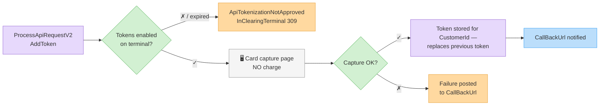
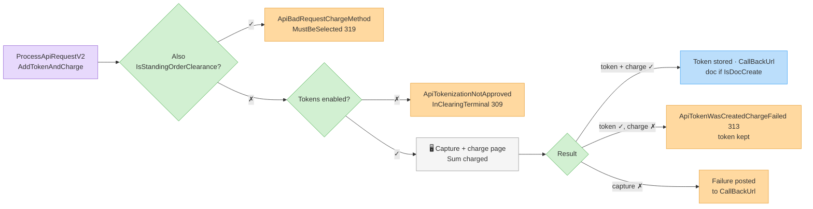
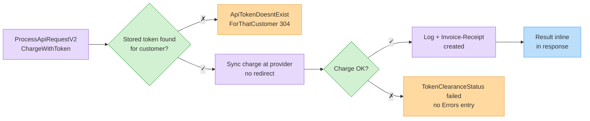

# Saved-Card Tokens

Save a customer's card as a **token** and charge it later, server-to-server. All flows go through [`ProcessApiRequestV2`](process-api-request-v2.md) with the flags below. For recurring monthly charges, see [Standing Orders (Recurring Charges)](standing-orders.md).


Tokenization must be enabled on your clearing terminal. Otherwise you get `ApiTokenizationNotApprovedInClearingTerminal` (309).


## Save a token — `AddToken`

Opens a hosted page that captures the card and stores a token, **without charging**. On Meshulam and Cardcom, a failed capture can return `ApiChargeAttemptPhoneInvalid` (314) — check the customer's phone number and retry.

```json
{
  "request": {
    "Invoice4UUserApiKey": "d2f1a6b3-1234-4c9a-9f00-1a2b3c4d5e6f",
    "AddToken": true,
    "FullName": "Israel Israeli",
    "Phone": "0501234567",
    "Email": "israel@example.com",
    "CustomerId": 88231,
    "ReturnUrl": "https://shop.example/card-saved",
    "CallBackUrl": "https://shop.example/api/i4u-callback"
  }
}
```

Redirect the customer to the returned `ClearingRedirectUrl`. The token is stored against the customer (`CustomerId` recommended so the token is retrievable later).


```mermaid
flowchart LR
    classDef step fill:#E7D9FC,stroke:#9B6DD6,color:#333
    classDef dec fill:#D2F0D2,stroke:#4CAF50,color:#333
    classDef err fill:#FFD9A0,stroke:#E8A33D,color:#333
    classDef cb fill:#BBDEFB,stroke:#42A5F5,color:#333
    classDef page fill:#F5F5F5,stroke:#999,color:#333

    A[ProcessApiRequestV2<br/>AddToken]:::step --> B{Tokens enabled<br/>on terminal?}:::dec
    B -- "✗ / expired" --> E1[ApiTokenizationNotApproved<br/>InClearingTerminal 309]:::err
    B -- ✓ --> C[🖥 Card capture page<br/>NO charge]:::page
    C --> D{Capture OK?}:::dec
    D -- ✓ --> F[Token stored for CustomerId —<br/>replaces previous token]:::step
    F --> G[CallBackUrl notified]:::cb
    D -- ✗ --> H[Failure posted<br/>to CallBackUrl]:::err
```

## Save + charge — `AddTokenAndCharge`

Same as above but also charges `Sum` immediately. Cannot be combined with `IsStandingOrderClearance` (`ApiBadRequestChargeMethodMustBeSelected`, 319). On Meshulam and Cardcom, a failed card-capture attempt can return `ApiChargeAttemptPhoneInvalid` (314) — check the customer's phone number and retry.


```mermaid
flowchart LR
    classDef step fill:#E7D9FC,stroke:#9B6DD6,color:#333
    classDef dec fill:#D2F0D2,stroke:#4CAF50,color:#333
    classDef err fill:#FFD9A0,stroke:#E8A33D,color:#333
    classDef cb fill:#BBDEFB,stroke:#42A5F5,color:#333
    classDef page fill:#F5F5F5,stroke:#999,color:#333

    A[ProcessApiRequestV2<br/>AddTokenAndCharge]:::step --> B{Also<br/>IsStandingOrderClearance?}:::dec
    B -- ✓ --> E1[ApiBadRequestChargeMethod<br/>MustBeSelected 319]:::err
    B -- ✗ --> C{Tokens enabled?}:::dec
    C -- ✗ --> E2[ApiTokenizationNotApproved<br/>InClearingTerminal 309]:::err
    C -- ✓ --> D[🖥 Capture + charge page<br/>Sum charged]:::page
    D --> F{Result}:::dec
    F -- "token + charge ✓" --> G[Token stored · CallBackUrl<br/>doc if IsDocCreate]:::cb
    F -- "token ✓, charge ✗" --> E3[ApiTokenWasCreatedChargeFailed 313<br/>token kept]:::err
    F -- "capture ✗" --> E4[Failure posted<br/>to CallBackUrl]:::err
```

## Charge a saved token — `ChargeWithToken`

Server-to-server, synchronous — no redirect:

```json
{
  "request": {
    "Invoice4UUserApiKey": "d2f1a6b3-1234-4c9a-9f00-1a2b3c4d5e6f",
    "ChargeWithToken": true,
    "CustomerId": 88231,
    "Sum": 117.0,
    "Description": "Monthly subscription - July",
    "IsDocCreate": true,
    "DocHeadline": "Monthly subscription - July"
  }
}
```

The stored token for the customer is resolved automatically. `CustomerId` is **required** — every provider integration dereferences it to find the stored token, so omitting it fails without a clean API error. Saving a new card for the customer **replaces** the previous token, so at most one token is kept per customer. The result is returned inline — see [Token charge response](#token-charge-response).


```mermaid
flowchart LR
    classDef step fill:#E7D9FC,stroke:#9B6DD6,color:#333
    classDef dec fill:#D2F0D2,stroke:#4CAF50,color:#333
    classDef err fill:#FFD9A0,stroke:#E8A33D,color:#333
    classDef cb fill:#BBDEFB,stroke:#42A5F5,color:#333

    A[ProcessApiRequestV2<br/>ChargeWithToken]:::step --> B{Stored token found<br/>for customer?}:::dec
    B -- ✗ --> E1[ApiTokenDoesntExist<br/>ForThatCustomer 304]:::err
    B -- ✓ --> C[Sync charge at provider<br/>no redirect]:::step
    C --> D{Charge OK?}:::dec
    D -- ✓ --> F[Log + Invoice-Receipt<br/>created]:::step
    F --> G[Result inline<br/>in response]:::cb
    D -- ✗ --> H[TokenClearanceStatus failed<br/>no Errors entry]:::err
```

### Token charge response

A declined charge does **not** add an entry to `Errors` — read `OpenInfo` → `TokenClearanceStatus` (or `ClearingRedirectUrl`):

| Outcome | `ClearingRedirectUrl` | `OpenInfo` | `Errors` |
| ------- | --------------------- | ---------- | -------- |
| Charged | `"token-clearance-success"` | `PaymentId`, `TokenClearanceStatus: "success"`, `I4UClearingLogId`, `DocumentCreationStatus` (+ `DocumentError*` when the document failed; + `ClearingTraceId` on Meshulam and UPay) | `null` |
| Declined by the provider | `"token-clearance-failed"` | `TokenClearanceStatus: "failed"` (may also carry provider details) | `null` |
| No stored token for the customer | `"token-clearance-failed"` | `TokenClearanceStatus: "failed"` | `ApiTokenDoesntExistForThatCustomer` (304) |

A decline has no error code in the response. On Cardcom, `OpenInfo` → `ClearingTraceId` carries the provider's raw reply (including its `Description`); on every provider, the reason is recorded as `ErrorMessage` on the response row in your [clearing logs](clearing-logs.md) (search with `IsSuccess: false`).

The complete response to the request above, from a Cardcom terminal:

```json
{
  "d": {
    "__type": "ApiClearingRequest:#Invoice.Common",
    "Errors": null,
    "Info": null,
    "OpenInfo": [
      { "Key": "PaymentId", "Value": "100200301" },
      { "Key": "TokenClearanceStatus", "Value": "success" },
      { "Key": "I4UClearingLogId", "Value": "123460" },
      { "Key": "DocumentCreationStatus", "Value": "success" }
    ],
    "RecaptchaToken": null,
    "AddToken": false,
    "AddTokenAndCharge": false,
    "CallBackUrl": null,
    "ChargeWithToken": true,
    "CipherText": "<document view cipher>",
    "CipherTextOriginal": "<original document cipher>",
    "ClearingRedirectUrl": "token-clearance-success",
    "CreditCardCompanyType": null,
    "Currency": null,
    "CustomerId": 88231,
    "Description": "Monthly subscription - July",
    "DocBranchId": null,
    "DocComments": null,
    "DocHeadline": "Monthly subscription - July",
    "DocItemCode": null,
    "DocItemName": null,
    "DocItemPrice": null,
    "DocItemQuantity": null,
    "DocItemTaxRate": null,
    "DocLanguage": null,
    "DocumentId": "d4c3b2a1-0000-4000-8000-000000000004",
    "DocumentNumber": 0,
    "Email": null,
    "FullName": null,
    "Invoice4UUserApiKey": "d2f1a6b3-1234-4c9a-9f00-1a2b3c4d5e6f",
    "Invoice4UUserEmail": null,
    "Invoice4UUserPassword": null,
    "IsApplePay": null,
    "IsAutoCreateCustomer": false,
    "IsBitPayment": null,
    "IsDocCreate": true,
    "IsGeneralClient": false,
    "IsGooglePay": null,
    "IsItemsBase64Encoded": null,
    "IsManualDocCreationsWithParams": false,
    "IsQaMode": false,
    "IsStandingOrderClearance": false,
    "IsStandingOrderRequest": false,
    "Language": null,
    "OrderIdClientUsage": null,
    "PaymentId": null,
    "PaymentsNum": 0,
    "Phone": null,
    "Platform": null,
    "Refund": false,
    "ReturnUrl": null,
    "StandingOrderCallBackUrl": null,
    "StandingOrderDuration": null,
    "StandingOrderFirstChargeAmount": null,
    "Sum": 117,
    "TaxPercentage": null,
    "Type": 0
  }
}
```


**A document is created after every successful token charge — even without `IsDocCreate`.** The token-charge flow doesn't check the flag: it issues an Invoice-Receipt and returns `IsDocCreate: true`. `DocumentNumber` is not returned (it stays `0`) — use `DocumentId` with [Get Document](../documents/get-document.md).


## Related

* **Standing orders** (`IsStandingOrderClearance`) also save the card and charge it monthly — see [Standing Orders (Recurring Charges)](standing-orders.md).

## Errors

| Error (ID) | Meaning |
| ---------- | ------- |
| `ApiTokenizationNotApprovedInClearingTerminal` (309) | Tokens not enabled on the terminal (or token feature expired). |
| `ApiTokenDoesntExistForThatCustomer` (304) | No (or multiple) stored token for the customer. |
| `ApiTokenWasCreatedChargeFailed` (313) | `AddTokenAndCharge` only: token stored, charge declined. |
| `ApiChargeAttemptPhoneInvalid` (314) | `AddToken`/`AddTokenAndCharge` (Meshulam, Cardcom): the hosted card-capture page failed, often due to invalid phone/customer data. |
| `ApiBadRequestChargeMethodMustBeSelected` (319) | Conflicting mode flags. |

## Try it

In the sandbox, choose the **Save a card token (no charge)** or **Charge a saved token (server-to-server)** example to run these requests as cURL, JavaScript, Python or HTTP.



