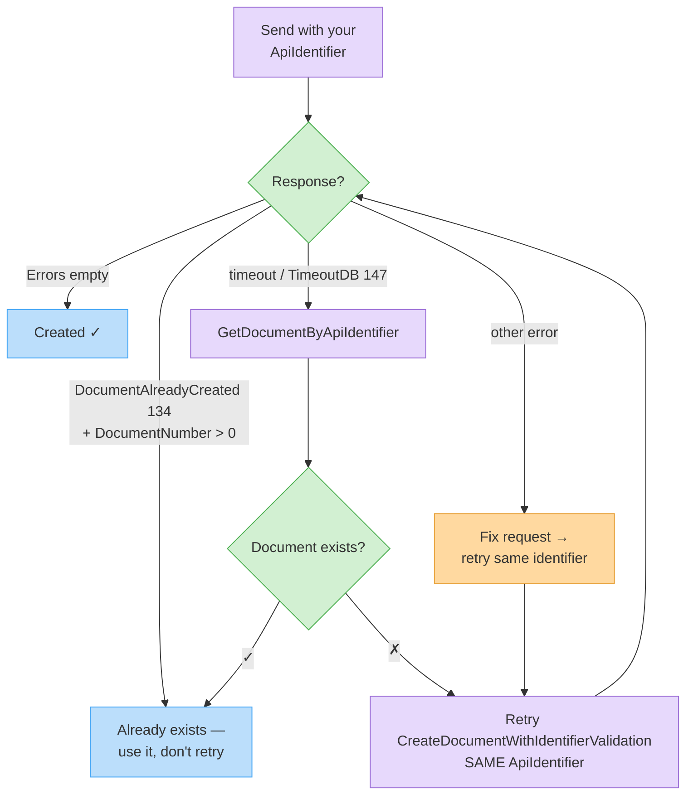

# Create a Document with Identifier Validation

Same as [Create a Document](create-document.md), but with strict idempotency: if a document with the same `ApiIdentifier` (and type) already exists in your organization, the call **does not create a new document** — it returns the existing one with the `DocumentAlreadyCreated` error attached.

Use this endpoint when your system may retry requests (queues, webhooks, network timeouts).

## Endpoint

| | |
| - | - |
| **Method** | `POST` |
| **Path** | `/CreateDocumentWithIdentifierValidation` |
| **Response** | `Document` — new one, or existing one + `DocumentAlreadyCreated` (134) |

## Request schema

Identical to [Create a Document](create-document.md):

| Field | Type | Required | Description |
| ----- | ---- | -------- | ----------- |
| `doc` | Document | Yes | The document. **Always set `ApiIdentifier`** — the deduplication key, unique per document in your system. |
| `token` | string | Yes | Authentication token. |

## Example request

```http
POST /Services/ApiService.svc/CreateDocumentWithIdentifierValidation HTTP/1.1
Host: apiqa.invoice4u.co.il
Content-Type: application/json

{
  "doc": {
    "DocumentType": 1,
    "Subject": "Order #10045",
    "ClientID": 88231,
    "ApiIdentifier": "order-10045-invoice",
    "Items": [
      { "Name": "Widget", "Quantity": 2, "Price": 50.0 }
    ],
    "AssociatedEmails": [
      { "Mail": "billing@acme.example" }
    ]
  },
  "token": "<token>"
}
```

## Duplicate response

When `ApiIdentifier` already exists, the response is the **existing** document plus the error:

```json
{
  "CreateDocumentWithIdentifierValidationResult": {
    "ID": "7f6a2c1e-8b4d-4f2a-9c3e-0d1e2f3a4b5c",
    "DocumentNumber": 20260119,
    "ApiIdentifier": "order-10045-invoice",
    "Errors": [
      { "ID": 134, "Error": "DocumentAlreadyCreated" }
    ]
  }
}
```

Treat error `134` with a returned `DocumentNumber > 0` as success-idempotent: the document already exists, no action needed.

## Retry flow



## Errors

All [Create a Document errors](create-document.md#common-errors) apply, plus the duplicate behavior above.

## Try it




