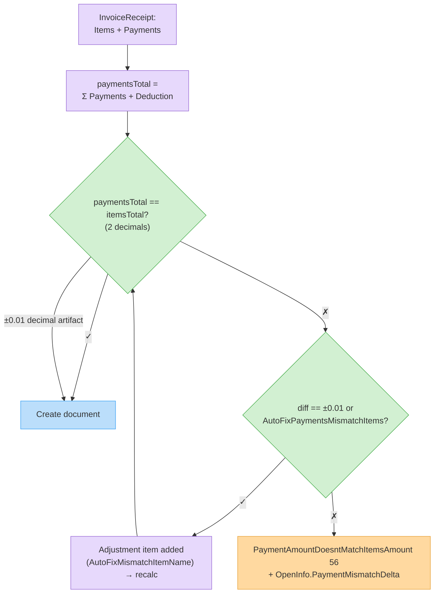

# Create a Document

Creates a signed, numbered document. This is the primary endpoint of the API.

## Endpoint

| | |
| - | - |
| **Method** | `POST` |
| **Path** | `/CreateDocument` |
| **Response** | `Document` object — check `Errors` first |

Variants:

| Path | Method | Notes |
| ---- | ------ | ----- |
| `/CreateDocument` | POST | Standard. |
| `/CreateDocumentREST` | GET/POST | Explicit REST variant, same body. |
| `/CreateDocumentWithIdentifierValidation` | POST | Rejects duplicates by `ApiIdentifier` — see [dedicated page](create-document-with-validation.md). |

## Request schema

| Field | Type | Required | Description |
| ----- | ---- | -------- | ----------- |
| `doc` | Document | Yes | The document to create. See [The Document Object](document-object.md) and per-type requirements in [Document Types](document-types.md). |
| `token` | string | Yes | Authentication token. |

## Example request — InvoiceReceipt (type 3)

```http
POST /Services/ApiService.svc/CreateDocument HTTP/1.1
Host: apiqa.invoice4u.co.il
Content-Type: application/json

{
  "doc": {
    "DocumentType": 3,
    "Subject": "Monthly subscription",
    "ClientID": 88231,
    "TaxIncluded": true,
    "Currency": "ILS",
    "ApiIdentifier": "my-system-order-10045",
    "Items": [
      {
        "Name": "Pro plan - June",
        "Quantity": 1,
        "Price": 117.00,
        "PriceIncludeTax": 117.00
      }
    ],
    "Payments": [
      {
        "PaymentType": 1,
        "Amount": 117.00,
        "Date": "2026-07-05T00:00:00",
        "NumberOfPayments": 1,
        "PaymentNumber": "4242"
      }
    ],
    "AssociatedEmails": [
      { "Mail": "billing@acme.example", "IsUserMail": false }
    ]
  },
  "token": "<token>"
}
```

## Example response

```json
{
  "CreateDocumentResult": {
    "ID": "7f6a2c1e-8b4d-4f2a-9c3e-0d1e2f3a4b5c",
    "DocumentNumber": 20260123,
    "DocumentType": 3,
    "Subject": "Monthly subscription",
    "Total": 117.0,
    "TotalWithoutTax": 100.0,
    "TotalTaxAmount": 17.0,
    "StatusID": 2,
    "ApiIdentifier": "my-system-order-10045",
    "PrintOriginalPDFLink": "https://newview.invoice4u.co.il/Views/PDF.aspx?cipher=...",
    "PrintCertifiedCopyPDFLink": "https://newview.invoice4u.co.il/Views/PDF.aspx?cipher=...",
    "Errors": []
  }
}
```


On QA the PDF links point to `newviewqa.invoice4u.co.il`; on production to `newview.invoice4u.co.il`.


## Behavior notes

* **Totals are computed server-side** from `Items` (item-based types) or `Payments` (+`Deduction`) — you don't send `Total`.
* For **InvoiceReceipt**, payments total must equal items total (±0.01 rounding is auto-fixable — see `AutoFixPaymentsMismatchItems` on the [Document object](document-object.md)). Mismatch → `PaymentAmountDoesntMatchItemsAmount` (56) with `OpenInfo.PaymentMismatchDelta`.
* **Email delivery** happens automatically when `AssociatedEmails` is set; **SMS delivery** when `SmsMessages` is set.
* Organizations connected to **2Sign** with signable document flows get the document sent as a signing task instead of a plain email.
* Duplicate window: identical document within `ApiDuplicityTimeValidation` seconds (default 60) → `DocumentAlreadyCreated` (134).

### Flow — InvoiceReceipt totals & AutoFix



## Foreign-currency documents

Answers to the questions that come up most often when a document needs to be issued in a foreign currency (e.g. `USD`) instead of the organization's base currency.

**Can I create a document in a foreign currency (e.g. USD, with no conversion to ILS) through the API?**
Yes. Set `Currency` on the [Document object](document-object.md) to the ISO symbol you want (e.g. `"USD"`). The document is created and stored entirely in that currency — `Items`, `Payments` and the resulting `Total`/`TotalWithoutTax`/`TotalTaxAmount` are all in `USD`, not ILS. The API never silently converts the amounts you send.

**Which fields are required exactly?** (`Currency="USD"`, `ConversionRate=<rate>`, and what value does `ConvertToILS` or another field need?)
Only `Currency` is required to issue the document in a foreign currency:
* `Currency` — set to `"USD"` (or any symbol that exists in the currency list; an unrecognized symbol → `CurrencyDoesntExists`, 36).
* `ConversionRate` — optional, see the next question. It's stored as metadata for reporting/reconciliation against the organization's base currency; it does **not** rescale `Total` or any item/payment amount.
* `ConvertToILS` — not related to document creation at all. It's a **report/print display flag** used only by the PDF and Excel export services (open-accounts and income reports) to decide whether to additionally show a converted total next to the original-currency total. Leave it unset — `CreateDocument` ignores it.

**Is `ConversionRate` required when the currency isn't ILS, or is sending `0` enough for automatic calculation?**
Sending `0` (or omitting the field, which defaults to `0`) is enough — the server automatically resolves the rate between the organization's currency and `Currency` from the daily currency table. Only send an explicit non-zero `ConversionRate` if you need to lock in a specific rate yourself (e.g. one already agreed with the customer).


Example: an organization whose base currency is ILS creating a USD invoice just needs `"Currency": "USD"` in the request body — `ConversionRate` can be omitted entirely.


## Common errors

| Error (ID) | Meaning |
| ---------- | ------- |
| `UnauthorizedUser` (80) | Invalid token. |
| `DocumentTypeNotInRange` (33) | Unknown `DocumentType`. |
| `ClientDoesntExists` (7) / `ClientIDDoesntExists` (37) | Missing/unknown customer. |
| `CurrencyDoesntExists` (36) | `Currency` symbol isn't in the supported currency list. |
| `DocumentItemsNotSpecified` (34) / `DocumentItemMissingName` (39) / `DocumentItemQuantityCannotBeZero` (40) / `DocumentItemPriceCannotBeZero` (41) | Item validation. `Paramters` holds the row number. |
| `PaymentsNotSpecified` (45) / `PaymentDateMissing` (46) / `PaymentAmountCannotBeZero` (47) / `PaymentTypeOutOfRange` (51) | Payment validation. |
| `PaymentAmountDoesntMatchItemsAmount` (56) | Payments ≠ items total. |
| `InvalidDateRange` (3) | `IssueDate` in the future or before your latest document. |
| `DocumentAlreadyCreated` (134) | Duplicate detected. |
| `NotEnoughDocuments` (65) / `NotEnoughCredits` (18) | Document quota exhausted. |
| `ExpiredAccount` (66) | Account subscription expired. |
| `ActionRestrictedForUser` (141) | The user is restricted from creating this document type. |
| `TimeoutDB` (147) | Server error during creation — verify with [GetDocumentByApiIdentifier](get-document.md) before retrying. |

## Try it




