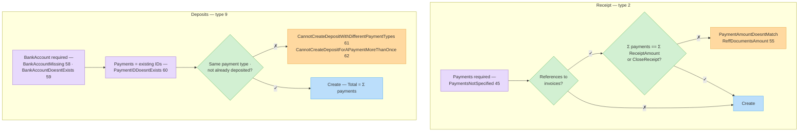

# Document Types

The `DocumentType` field on every document is a numeric enum:

| Value | Type | Hebrew | Description |
| ----- | ---- | ------ | ----------- |
| `1` | Invoice | חשבונית מס | Tax invoice. |
| `2` | Receipt | קבלה | Payment receipt against invoices. |
| `3` | InvoiceReceipt | חשבונית מס קבלה | Combined invoice + receipt (most common for immediate payment). |
| `4` | InvoiceCredit | חשבונית זיכוי | Credit invoice (refund/cancellation). See the dedicated [Credit Invoices guide](credit-invoices.md) for full & partial credits. |
| `5` | ProformaInvoice | חשבון עסקה | Proforma invoice. |
| `6` | InvoiceOrder | הזמנת עבודה | Work order. |
| `7` | InvoiceQuote | הצעת מחיר | Price quote. |
| `8` | InvoiceShip | תעודת משלוח | Delivery note. |
| `9` | Deposits | הפקדה | Bank deposit of collected payments. |
| `10` | SupplierInvoiceToInventory | חשבונית ספק למלאי | Supplier invoice received into inventory. |
| `13` | PurchaseOrder | הזמנת רכש | Purchase order (requires `SupplierId`/`SupplierName`). |

### What each type requires

| Type | `Items` | `Payments` | `Invoices` (referenced docs) |
| ---- | ------- | ---------- | ---------------------------- |
| Invoice (1) | **Required** | — | Optional (quote/order/ship/proforma refs) |
| Receipt (2) | — | **Required** | Optional (invoice/proforma refs); payments total must match referenced amounts unless `CloseReceipt` |
| InvoiceReceipt (3) | **Required** | **Required** — totals must match items total (see `AutoFixPaymentsMismatchItems`) | Optional (proforma/order/quote/ship refs) |
| InvoiceCredit (4) | Optional | Optional | At least one of Items / Payments / Invoices — refs to Invoice or InvoiceReceipt |
| ProformaInvoice (5) | **Required** | — | Optional (quote refs) |
| InvoiceOrder (6) | **Required** | — | Optional (quote refs) |
| InvoiceQuote (7) | **Required** | — | — |
| InvoiceShip (8) | **Required** (price may be 0) | — | Optional (order refs) |
| Deposits (9) | — | **Required** — existing payment IDs, all of the same payment type, not previously deposited; `BankAccount` required | — |
| SupplierInvoiceToInventory (10) | **Required** (inventory items) | — | — |
| PurchaseOrder (13) | **Required** | — | — |

### Referenced-document rules (`DocumentReffType`)

When creating a document against existing documents (`Invoices` array), `DocumentReffType` must be one of the allowed source types:

| Creating | Allowed `DocumentReffType` |
| -------- | -------------------------- |
| Invoice (1) | InvoiceQuote (7), InvoiceOrder (6), InvoiceShip (8), ProformaInvoice (5) |
| Receipt (2) | Invoice (1), ProformaInvoice (5); Receipt (2) only when `CancelDocument` is `true` |
| InvoiceReceipt (3) | ProformaInvoice (5), InvoiceOrder (6), InvoiceQuote (7), InvoiceShip (8) |
| InvoiceCredit (4) | Invoice (1), InvoiceReceipt (3) |
| InvoiceOrder (6) | InvoiceQuote (7) |
| InvoiceShip (8) | InvoiceOrder (6) |

Violations return `DocumentReffTypeNotInRange` (53). Each referenced document must belong to your organization, match the customer, be in a valid status, and the `ReceiptAmount` per reference must not exceed the open balance — otherwise `DocumentReceiptAmountOutOfRange` (50) / `DocumentStatusInValid` (49).

### Document statuses (`StatusID`)

| Value | Status |
| ----- | ------ |
| `1` | Open |
| `2` | Closed |
| `3` | Fully credited |
| `4` | Partially credited |
| `5` | Cancelled |

### Lawyer accounts

For lawyer occupation accounts, `Items[0].LawyerIdentifier` set to `"1"` marks the document as Deposits (פקדונות) and `"2"` as Expenses (הוצאות); the API sets `LawyerDocType` accordingly.
