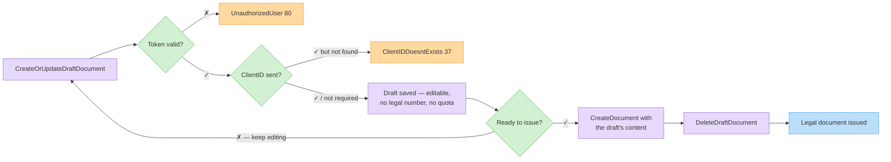

# Draft Documents

Drafts are editable, non-final documents: they have **no legal document number**, don't consume your document quota, and can be updated or deleted freely. Use them to stage a document before issuing it, or to persist in-progress documents from your UI.


There is no "promote draft" endpoint. To issue a draft: read it, pass its content to [Create a Document](create-document.md), then delete the draft.




## Create or update — `CreateOrUpdateDraftDocument`

| | |
| - | - |
| **Method** | `POST` |
| **Path** | `/CreateOrUpdateDraftDocument` |
| **Body** | `{ "doc": { ... }, "token": "<token>" }` |
| **Response** | The saved draft `Document` (with its draft `ID` GUID) |

Behavior differences vs. [Create a Document](create-document.md):

* **Relaxed validation** — items are optional (totals are zeroed when absent), payments optional, no date-range or quota checks.
* The customer is validated **only if `ClientID` is sent** (`ClientIDDoesntExists`, 37); Deposits drafts skip customer validation entirely.
* Sending an existing draft `ID` **updates** that draft.
* `IsPreviewDocument: true` targets the organization's single **preview document** slot (upserted) — see [`GetPreviewDocumentByToken`](#preview-document--getpreviewdocumentbytoken).

```http
POST /Services/ApiService.svc/CreateOrUpdateDraftDocument HTTP/1.1
Host: apiqa.invoice4u.co.il
Content-Type: application/json

{
  "doc": {
    "DocumentType": 1,
    "Subject": "Draft for order #10052",
    "ClientID": 88231,
    "Items": [
      { "Name": "Widget", "Quantity": 2, "Price": 50.0 }
    ]
  },
  "token": "<token>"
}
```

## Get one — `GetDraftDocument`

```json
{ "docId": "7f6a2c1e-8b4d-4f2a-9c3e-0d1e2f3a4b5c", "token": "<token>" }
```

`POST /GetDraftDocument` — returns the draft `Document`; `null` on a malformed GUID.

## Search — `GetDraftDocuments`

```json
{ "dr": { "DocumentType": 1 }, "token": "<token>" }
```

`POST /GetDraftDocuments` — same `DocumentsRequest` filters as [Search Documents](search-documents.md); returns `CommonCollection<Document[]>` of drafts.

## Existence check — `CheckIfDraftExistsByDocumentType`

```json
{ "docType": 1, "token": "<token>" }
```

`POST /CheckIfDraftExistsByDocumentType` — returns `true`/`false`; `null` when the token is invalid.

## Delete — `DeleteDraftDocument` / `DeleteDraftDocuments`

```json
{ "docId": "7f6a2c1e-8b4d-4f2a-9c3e-0d1e2f3a4b5c", "token": "<token>" }
```

`POST /DeleteDraftDocument` — single draft. Batch variant `POST /DeleteDraftDocuments` takes `{ "docIds": ["...", "..."], "token": "..." }`.

## Preview document — `GetPreviewDocumentByToken`

```json
{ "token": "<token>" }
```

`POST /GetPreviewDocumentByToken` — returns the organization's preview document (the one saved with `IsPreviewDocument: true`). One preview slot per organization.

## Errors

| Error (ID) | Meaning |
| ---------- | ------- |
| `UnauthorizedUser` (80) | Invalid token. |
| `ClientIDDoesntExists` (37) | `ClientID` sent but no such customer. |
| `ServerErrorOnDocumentCreate` (11) | Draft could not be saved. |
| `DraftDocumentDeleteError` (135) | Draft not found / could not be deleted (per `docId`). |
| `GeneralError` (0) | Server error. |

## Try it






