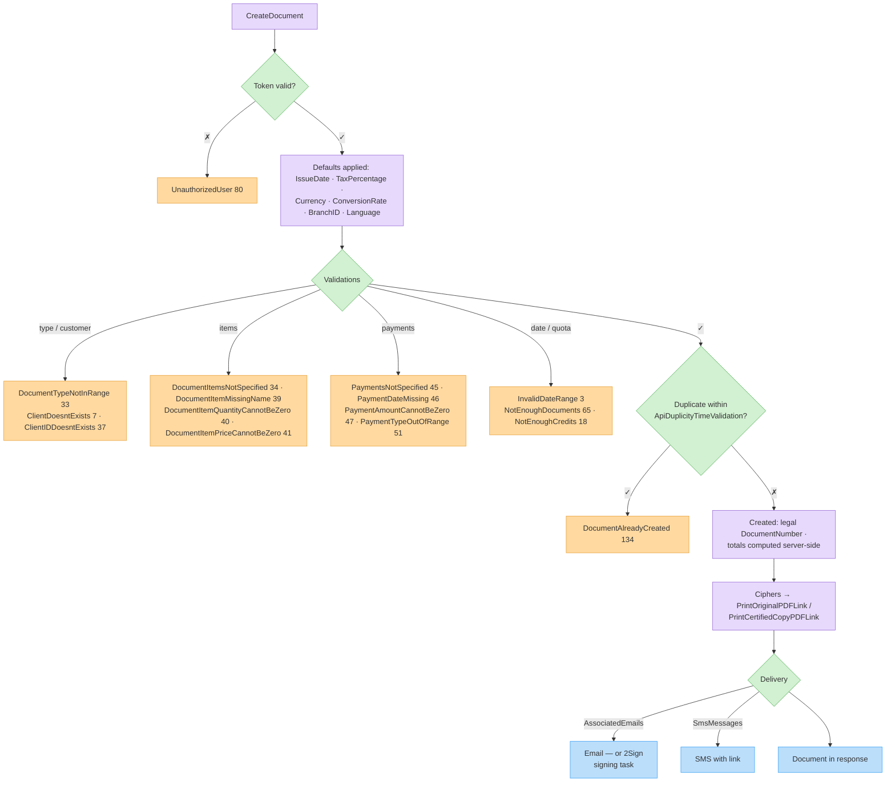

# Document Endpoints Overview

Documents are the core of the Invoice4U API: invoices, receipts, invoice-receipts, credit invoices, quotes, orders and more. Once created, a document is signed, numbered, and legally final — it cannot be edited, only credited or cancelled by a follow-up document.

### Endpoints in this section

| Endpoint | Page |
| -------- | ---- |
| `CreateDocument` | [Create a Document](create-document.md) |
| `CreateDocumentWithIdentifierValidation` | [Create with Identifier Validation](create-document-with-validation.md) |
| `GetDocument`, `GetDocumentByNumber`, `GetDocumentByApiIdentifier`, `IsDocumentExistsByApiIdentifier` | [Get a Single Document](get-document.md) |
| `GetDocuments` | [Search Documents](search-documents.md) |
| `CreateOrUpdateDraftDocument`, `GetDraftDocument`, `GetDraftDocuments`, `DeleteDraftDocument`, `DeleteDraftDocuments`, `CheckIfDraftExistsByDocumentType`, `GetPreviewDocumentByToken` | [Draft Documents](draft-documents.md) |
| `FetchAllocationNumber`, `UpdateAllocationNumber` | [Allocation Numbers (Israel Tax)](allocation-numbers.md) |

### Reference pages

* [Document Types](document-types.md) — the `DocumentType` enum and what each type requires
* [The Document Object](document-object.md) — full field reference for `Document`, `DocumentItem`, `Payment`, `Discount` and related objects

### Typical creation flow

1. Authenticate → token.
2. Resolve the customer: existing `ClientID`, or supply a `GeneralCustomer` (allowed only for some types).
3. Build the `Document`: type, items and/or payments, emails to send to.
4. `POST /CreateDocument`.
5. Check `Errors`; on success, use the returned `DocumentNumber`, `ID` and the `PrintOriginalPDFLink` / `PrintCertifiedCopyPDFLink` fields.

### Duplicate protection

Two mechanisms prevent double-billing when your system retries:

| Mechanism | How it works |
| --------- | ------------ |
| `ApiIdentifier` | Your unique ID for the document. If you don't send one, the API generates `I4U-APIGEN-<guid>`. With [CreateDocumentWithIdentifierValidation](create-document-with-validation.md) the call is rejected with `DocumentAlreadyCreated` (134) if a document with the same identifier already exists — the existing document is returned. |
| `ApiDuplicityTimeValidation` | Time window in **seconds** (default `60`). If an identical document was created within the window, `CreateDocument` fails with `DocumentAlreadyCreated` (134). Set to a larger value for slow retry queues. |

### Sending by email & SMS

* `AssociatedEmails` on the document triggers email delivery of the document on creation.
* `SmsMessages` triggers SMS delivery (requires SMS credit on the account).
* `EmailCustomComment` customizes the email body comment.
