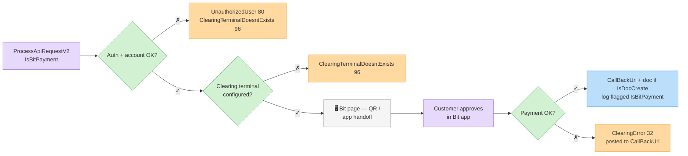
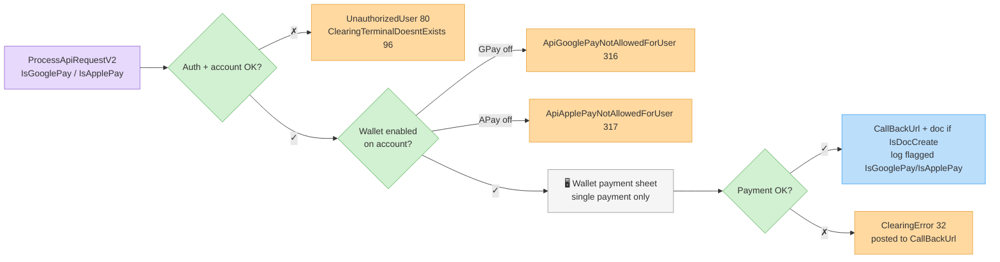

# ‫אמצעי תשלום חלופיים‬

‫אמצעי תשלום חלופיים המחויבים דרך אותה מתודת [`ProcessApiRequestV2`](process-api-request-v2.md), באמצעות דגלים ייעודיים. הם שונים מסליקת כרטיסים רגילה בהפעלה, בתמיכת הספקים ובהתנהגות השגיאות — התייחסו אליהם כמסלול אינטגרציה נפרד.‬

## ‫דגלי הבקשה‬

‫קבעו בדיוק **אחד** מאלה בבקשת הסליקה:‬

| ‫שדה‬ | ‫טיפוס‬ | ‫תיאור‬ |
| --- | ----- | ----- |
| `IsBitPayment` | boolean | ‫חיוב באמצעות **ביט**.‬ |
| `IsGooglePay` | boolean | ‫חיוב באמצעות **Google Pay**.‬ |
| `IsApplePay` | boolean | ‫חיוב באמצעות **Apple Pay**.‬ |

‫כל שאר שדות הבקשה עובדים כמו ב[בקשת סליקה רגילה](process-api-request-v2.md) — `Sum`, פרטי לקוח, `ReturnUrl`/`CallBackUrl`, ‏`IsDocCreate` וכו'.‬

## ‫דוגמה — תשלום ביט עם מסמך אוטומטי‬

```http
POST /Services/ApiService.svc/ProcessApiRequestV2 HTTP/1.1
Host: apiqa.invoice4u.co.il
Content-Type: application/json

{
  "request": {
    "Invoice4UUserApiKey": "<api-key>",
    "IsBitPayment": true,
    "Sum": 117.0,
    "FullName": "Israel Israeli",
    "Phone": "0501234567",
    "Email": "israel@example.com",
    "Description": "Order #10045",
    "IsDocCreate": true,
    "ReturnUrl": "https://shop.example/thanks",
    "CallBackUrl": "https://shop.example/api/i4u-callback",
    "IsQaMode": true
  }
}
```

‫התהליך הוא תהליך הדף המתארח: הפנו את הלקוח ל-`ClearingRedirectUrl` המוחזר, שם הוא משלים את התשלום באפליקציית הארנק / חלון התשלום.‬

## ‫מהלך — ביט‬



## ‫מהלך — Google Pay / Apple Pay‬



## ‫מגבלות‬

* ‫**נדרשת הפעלה בחשבון.** Google Pay ו-Apple Pay חייבים להיות מופעלים בחשבון ה-Invoice4U שלכם — אחרת הבקשה נדחית לפני שהיא מגיעה לספק (`ApiGooglePayNotAllowedForUser` ‏316 / `ApiApplePayNotAllowedForUser` ‏317).‬
* ‫**תמיכת ספקים משתנה.** לא כל ספק סליקה תומך בכל ארנק — הזמינות תלויה בחברת הסליקה ובמסוף המוגדרים בחשבונכם. אין בדיקה מקדימה לכך: אי-תמיכת הספק מוחזרת מהספק כ-`ClearingError` (32). אמתו מול תמיכת Invoice4U אילו אמצעים המסוף שלכם תומך לפני האינטגרציה.‬
* ‫**דף מתארח בלבד.** תשלומי ארנק מיועדים לדף המתארח האינטראקטיבי; ה-API אינו מאמת או דוחה שילוב של דגלי ארנק עם `ChargeWithToken` — ההתנהגות במקרה כזה תלוית ספק ואינה נתמכת, לכן אל תשלבו ביניהם.‬
* ‫**ללא תשלומים.** חיובי ארנק מיועדים לתשלום בודד. גם כאן ה-API אינו מאמת זאת — שליחת אפשרויות תשלומים `PaymentsNum`/`Type` יחד עם דגל ארנק היא בעלת התנהגות תלוית-ספק ולא מוגדרת; התייחסו לארנקים כתשלום בודד בלבד.‬
* ‫מסמכים שנוצרים עבור חיובים אלה רושמים את התשלום בסוג התשלום המתאים (למשל ביט מופיע כסוג תשלום ביט/אחר על המסמך), ושורות [לוג הסליקה](clearing-logs.md) נושאות את הדגלים `IsBitPayment` / `IsGooglePay` / `IsApplePay` לצורך התאמות.‬

## ‫שגיאות‬

| ‫שגיאה (ID)‬ | ‫משמעות‬ |
| ---------- | ------- |
| `ApiGooglePayNotAllowedForUser` (316) | ‫Google Pay לא מופעל בחשבון.‬ |
| `ApiApplePayNotAllowedForUser` (317) | ‫Apple Pay לא מופעל בחשבון.‬ |
| `ClearingTerminalDoesntExists` (96) | ‫אין מסוף סליקה פעיל ותקין (חסר מסוף/שם משתמש/סיסמה).‬ |
| `ClearingError` (32) | ‫התשלום נדחה / שגיאת ספק — פרטים ב-`Paramters`.‬ |
