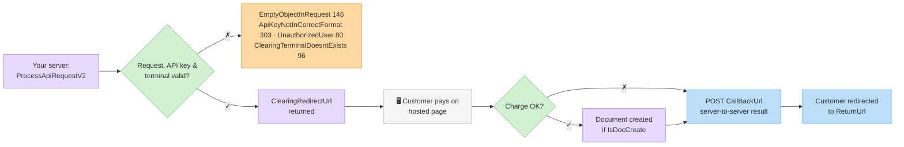

# ‫סקירת מתודות סליקה‬

‫ה-API של הסליקה מחייב כרטיסי אשראי (וגם ביט / Google Pay / Apple Pay) דרך חשבון הסליקה המוגדר על הארגון שלכם ב-Invoice4U, ויכול ליצור אוטומטית את המסמך המתאים.‬

### ‫חברות סליקה נתמכות‬

‫ה-API עובד עם ספק הסליקה המוגדר בחשבונכם — כולל **משולם**, **קארדקום** ו-**UPay**. התהליך זהה מהצד שלכם; ה-API מנתב לספק שלכם.‬

### ‫תהליך הדף המתארח‬

‫רוב החיובים משתמשים בדף תשלום מתארח:‬

1. ‫קראו ל-[`ProcessApiRequestV2`](process-api-request-v2.md) עם הסכום, פרטי הלקוח והדגלים.‬
2. ‫הפנו את הלקוח ל-`ClearingRedirectUrl` המוחזר.‬
3. ‫Invoice4U מודיע ל-`CallBackUrl` שלכם ומפנה את הלקוח ל-`ReturnUrl` שלכם.‬
4. ‫אם `IsDocCreate` היה `true`, המסמך נוצר אוטומטית לאחר חיוב מוצלח.‬

‫**חיובי טוקן** (`ChargeWithToken`) ו**זיכויים** (`Refund`) הם שרת-לשרת — ללא הפניה; התוצאה מוחזרת סינכרונית.‬

### ‫וריאציות‬

| ‫וריאציה‬ | ‫דגל/ים‬ | ‫עמוד‬ |
| ------- | ------ | ---- |
| ‫חיוב רגיל (דף מתארח)‬ | — | ‫[ביצוע בקשת סליקה (V2)](process-api-request-v2.md)‬ |
| ‫חיוב בתשלומים / קרדיט‬ | `Type` = 2/3 | ‫[ביצוע בקשת סליקה (V2)](process-api-request-v2.md)‬ |
| ‫ביט / Google Pay / Apple Pay‬ | `IsBitPayment` / `IsGooglePay` / `IsApplePay` | ‫[ביט, Google Pay ו-Apple Pay](alternative-payment-methods.md)‬ |
| ‫שמירת טוקן כרטיס בלבד‬ | `AddToken` | ‫[טוקנים (כרטיסים שמורים)](tokens-and-standing-orders.md)‬ |
| ‫שמירת טוקן + חיוב‬ | `AddTokenAndCharge` | ‫[טוקנים (כרטיסים שמורים)](tokens-and-standing-orders.md)‬ |
| ‫חיוב טוקן שמור‬ | `ChargeWithToken` | ‫[טוקנים (כרטיסים שמורים)](tokens-and-standing-orders.md)‬ |
| ‫הוראת קבע (חיוב חוזר)‬ | `IsStandingOrderClearance` | ‫[הוראות קבע (חיובים חוזרים)](standing-orders.md)‬ |
| ‫זיכוי‬ | `Refund` | ‫[ביצוע בקשת סליקה (V2)](process-api-request-v2.md#refunds)‬ |
| ‫שאילתת היסטוריית חיובים‬ | — | ‫[לוגי סליקה](clearing-logs.md)‬ |
| ‫בדיקת חשבון הסליקה והפיצ'רים המופעלים‬ | — | ‫[שליפת חשבון הסליקה](get-clearing-account.md)‬ |


‫`ProcessApiRequest` (V1) ווריאציות ה-GET ‏`ProcessApiRequestFullContents*` עדיין עובדות אך הן **legacy**. אינטגרציות חדשות צריכות להשתמש ב-`ProcessApiRequestV2` בלבד.‬


### ‫דרישות מוקדמות‬

* ‫חשבון סליקה מוגדר ופעיל בארגון שלכם (מוגדר באפליקציית האינטרנט של Invoice4U). בדקו אותו עם [`GetClearingAccount`](get-clearing-account.md).‬
* ‫לטוקנים / הוראות קבע: פיצ'ר הטוקן / הוראת הקבע מופעל על מסוף הסליקה שלכם (אחרת `ApiTokenizationNotApprovedInClearingTerminal` ‏309 / `ApiStandingOrderNotApprovedInClearingTerminal` ‏310).‬
* ‫לביט / Google Pay / Apple Pay: ראו [ביט, Google Pay ו-Apple Pay](alternative-payment-methods.md) — אמצעי ארנק דורשים הפעלה בחשבון ותמיכת ספק.‬
