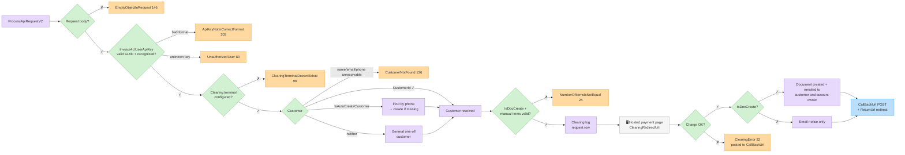
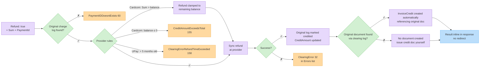

# ‫ביצוע בקשת סליקה (גרסה 2)‬

‫מתודת הסליקה המרכזית. יוצרת דף תשלום מתארח, מחייבת טוקן שמור, או מזכה חיוב קודם — ואופציונלית יוצרת את המסמך המתאים.‬

## ‫מתודה‬

| | |
| - | - |
| ‫**מתודה**‬ | `POST` |
| ‫**נתיב**‬ | `/ProcessApiRequestV2` |
| ‫**תשובה**‬ | ‫ה-`ApiClearingRequest` שלכם מוחזר עם התוצאה (`ClearingRedirectUrl`, `OpenInfo`, …) — בדקו את `Errors` תחילה. ראו [שדות התשובה](#response-fields).‬ |

## ‫מהלך — חיוב רגיל‬



## ‫סכימת הבקשה — `request` (ApiClearingRequest)‬

### ‫אימות‬

| ‫שדה‬ | ‫טיפוס‬ | ‫חובה‬ | ‫תיאור‬ |
| --- | ----- | ---- | ----- |
| `Invoice4UUserApiKey` | string (GUID) | ‫**כן**‬ | ‫מפתח ה-API של הארגון שלכם — אמצעי האימות היחיד הנתמך לסליקה.‬ |


‫סליקה מחייבת **חשבון סליקה פעיל (מסוף)** בארגון שלכם, וכן את מזהי הלקוח שלהלן (`FullName`, `Phone`, `Email`) — הם משמשים לאימות המשלם מול מסוף הסליקה ולזיהוי בדף התשלום.‬


‫ספק הסליקה הוא זה שמוגדר במסוף שלכם — אחת מהחברות הנתמכות (`ClearingCompanies`): **Cardcom (15)**, **UPay (6)** או **Meshulam (7)**. הבקשה זהה עבור כולן; ה-API מנתב לספק שלכם אוטומטית לפי חשבון הסליקה המוגדר בארגון שלכם.‬

### ‫פרטי החיוב‬

| ‫שדה‬ | ‫טיפוס‬ | ‫חובה‬ | ‫תיאור‬ |
| --- | ----- | ---- | ----- |
| `Sum` | double | ‫**כן**‬ | ‫הסכום לחיוב.‬ |
| `CreditCardCompanyType` | int | ‫לא‬ | ‫קוד חברת אשראי אופציונלי שמועתק לרשומת החיוב הפנימית כאשר ערכו גדול מ-0. הוא **אינו** בוחר את ספק הסליקה — הספק שנעשה בו שימוש הוא חשבון הסליקה המוגדר בארגון שלכם (Cardcom, UPay או Meshulam). השאירו ללא הגדרה אלא אם הונחיתם אחרת על ידי התמיכה של Invoice4U.‬ |
| `Currency` | string | ‫לא‬ | ‫`"NIS"` (ברירת מחדל; `"ILS"` מתקבל ככינוי), `"USD"`, `"EUR"`.‬ |
| `Type` | int | ‫לא‬ | ‫`1` רגיל (ברירת מחדל), `2` תשלומים, `3` תשלומי קרדיט. `4` הוא ערך פנימי ותלוי-ספק — אל תשלחו אותו. לביצוע זיכוי, השתמשו ב-`Refund: true` + `PaymentId` (ראו [זיכויים](#refunds)).‬ |
| `PaymentsNum` | int | ‫לא‬ | ‫מספר תשלומים כאשר `Type` הוא 2/3.‬ |
| `Description` | string | ‫לא‬ | ‫תיאור החיוב (מוצג בדף/במסמך).‬ |
| `IsQaMode` | boolean | ‫לא‬ | ‫`true` בבדיקות מול QA.‬ |
| `OrderIdClientUsage` | string | ‫לא‬ | ‫מזהה ההזמנה שלכם, מוחזר בקולבקים.‬ |
| `Platform` | string | ‫לא‬ | ‫מזהה טקסט חופשי של הפלטפורמה שלכם; נרשם יחד עם החיוב.‬ |

‫חיובי ביט / Google Pay / Apple Pay משתמשים בדגלים `IsBitPayment` / `IsGooglePay` / `IsApplePay` — ראו [ביט, Google Pay ו-Apple Pay](alternative-payment-methods.md) להפעלה, מגבלות ושגיאות.‬

### ‫לקוח‬

| ‫שדה‬ | ‫טיפוס‬ | ‫חובה‬ | ‫תיאור‬ |
| --- | ----- | ---- | ----- |
| `CustomerId` | int | ‫מותנה‬ | ‫לקוח קיים. השם/אימייל/טלפון שלו משמשים לדף ולהתראות.‬ |
| `FullName` | string | ‫**כן** (ללא `CustomerId`)‬ | ‫שם מלא של הלקוח — משמש לאימות המשלם מול המסוף. לא נבדק מראש על ידי ה-API; ערך חסר ייכשל בהמשך אצל ספק הסליקה.‬ |
| `Phone` | string | ‫**כן** (ללא `CustomerId`)‬ | ‫טלפון הלקוח — SMS/זיהוי בדף התשלום. לא נבדק מראש על ידי ה-API; ערך חסר ייכשל בהמשך אצל ספק הסליקה.‬ |
| `Email` | string | ‫מומלץ‬ | ‫אימייל הלקוח — זיהוי מול המסוף ומשלוח המסמך.‬ |
| `IsAutoCreateCustomer` | boolean | ‫לא‬ | ‫מאתר לקוח קיים לפי טלפון; אם לא נמצאת התאמה, נוצרת רשומת לקוח חדשה מתוך `FullName`/`Phone`/`Email`. התאמה לפי אימייל בלבד אינה נתמכת כרגע — ספקו `Phone` להתאמה אמינה. בלי הדגל הזה, החיוב משתמש בלקוח מזדמן.‬ |
| `IsGeneralClient` | boolean | ‫לא (ברירת מחדל `true`)‬ | ‫המסמך מופק ללקוח מזדמן.‬ |

### ‫הפניות וקולבקים‬

| ‫שדה‬ | ‫טיפוס‬ | ‫חובה‬ | ‫תיאור‬ |
| --- | ----- | ---- | ----- |
| `ReturnUrl` | string | ‫דף מתארח‬ | ‫לאן הלקוח מופנה לאחר התשלום.‬ |
| `CallBackUrl` | string | ‫מומלץ‬ | ‫כתובת התראה שרת-לשרת.‬ |

### ‫יצירת מסמך‬

| ‫שדה‬ | ‫טיפוס‬ | ‫חובה‬ | ‫תיאור‬ |
| --- | ----- | ---- | ----- |
| `IsDocCreate` | boolean | ‫לא‬ | ‫יצירת מסמך אוטומטית לאחר חיוב מוצלח. המסמך נשלח במייל גם ללקוח וגם לבעל החשבון.‬ |
| `DocHeadline` | string | ‫לא‬ | ‫נושא המסמך (ברירת מחדל: `Description`).‬ |
| `IsManualDocCreationsWithParams` | boolean | ‫לא‬ | ‫שליחת שורות פריטים מפורשות דרך שדות ה-`DocItem*` המופרדים ב-pipe שלהלן.‬ |
| `DocItemName` / `DocItemQuantity` / `DocItemPrice` | string | ‫**עם פריטים ידניים**‬ | ‫רשימות מופרדות ב-pipe, באורך שווה, למשל `"Item A\|Item B"`, `"1\|2"`, `"100\|50"`. ערכים חסרים/ריקים מחזירים שגיאת API נקייה (`DocumentItemMissingName` 39, `DocumentItemQuantityCannotBeZero` 40, `DocumentItemPriceCannotBeZero` 41).‬ |
| `DocItemTaxRate` | string | ‫**עם פריטים ידניים**‬ | ‫רשימת שיעורי מע"מ מופרדת ב-pipe, באותו אורך כמו `DocItemQuantity`/`DocItemPrice` (ערכים ריקים לכל פריט תקינים, למשל `"|"`). לא נבדק מראש — אם השדה **הושמט לגמרי** הבקשה נכשלת בשגיאת שרת לא מטופלת (500) במקום שגיאת API נקייה; אם מספר הפריטים המופרדים אינו תואם לרשימות האחרות, הבקשה נכשלת באותו אופן. שלחו אותו תמיד כאשר `IsManualDocCreationsWithParams` הוא `true`.‬ |
| `DocItemCode` / `DocBranchId` | string | ‫לא‬ | ‫מתקבלים על ידי הבקשה אך **אינם מוחלים** על המסמך שנוצר במימוש הנוכחי — אל תסתמכו עליהם לקוד פריט או שיוך סניף.‬ |
| `IsItemsBase64Encoded` | boolean | ‫לא‬ | ‫**לא נתמך** — הפענוח חלקי במימוש הנוכחי. שלחו את ערכי ה-`DocItem*` כטקסט UTF-8 רגיל, לא כ-Base64.‬ |
| `DocComments` | string | ‫לא‬ | ‫הערות המסמך.‬ |
| `Language` / `DocLanguage` | string | ‫לא‬ | ‫שפת הדף / המסמך (`"he"` / `"en"`).‬ |
| `TaxPercentage` | double | ‫לא‬ | ‫דריסת מע"מ למסמך.‬ |


‫`DocItemTaxRate` מתועד כאופציונלי אך **אינו נבדק** למול null במימוש הנוכחי כאשר `IsManualDocCreationsWithParams` הוא `true`. השמטתו, או שליחת פחות ערכים מופרדים ב-pipe מאשר ב-`DocItemQuantity`/`DocItemPrice`, גורמת לחריגה לא מטופלת ולא לרשומה ב-`Errors` — הקפידו לכלול אותו תמיד, באותו אורך כמו הרשימות האחרות, בעת יצירת מסמכים עם פריטים ידניים.‬


### ‫טוקנים, הוראות קבע, זיכויים‬

‫ראו [טוקנים (כרטיסים שמורים)](tokens-and-standing-orders.md) עבור `AddToken`, `AddTokenAndCharge`, `ChargeWithToken`, ו[הוראות קבע](standing-orders.md) עבור `IsStandingOrderClearance`, `StandingOrderDuration`, `StandingOrderFirstChargeAmount`, `StandingOrderCallBackUrl` — ו[זיכויים](#refunds) להלן עבור `Refund` + `PaymentId`. `IsStandingOrderRequest` שמור לשימוש פנימי.‬

### ‫שדות התשובה‬ {#response-fields}

‫התשובה היא אובייקט ה-`request` שלכם, מוחזר במלואו — **כל** השדות, כולל אלה שלא שלחתם (כ-`null`, `false` או `0`) — יחד עם `__type` ושדות התוצאה שלהלן. ראו את [הדוגמה המלאה](#example-response).‬

| ‫שדה‬ | ‫טיפוס‬ | ‫תיאור‬ |
| --- | ----- | ----- |
| `Errors` | array \| null | ‫שגיאות אימות וסליקה. **`null` כשאין שגיאות** (לא `[]`) — התייחסו ל-`null` ול-`[]` באותו אופן.‬ |
| `Info` | array \| null | ‫בזיכויים בלבד: `[{ "ID": 2, "Info": "SuccessfulAction" }]` בהצלחה. אחרת `null`.‬ |
| `OpenInfo` | array \| null | ‫ערכי התוצאה, כזוגות `{ "Key": "…", "Value": "…" }` (הערכים הם מחרוזות) — ראו [מפתחות OpenInfo](#openinfo-keys). `null` כשריק (למשל בזיכויים).‬ |
| `ClearingRedirectUrl` | string | ‫בקשות דף מתארח: כתובת דף התשלום — הפנו את הלקוח לכאן (אמתו אותה קודם, ראו להלן). `ChargeWithToken`: `"token-clearance-success"` או `"token-clearance-failed"`. זיכויים: `null`.‬ |
| `DocumentId` / `CipherText` / `CipherTextOriginal` | GUID / string | ‫ב-`ChargeWithToken` בלבד, כאשר נוצר מסמך (ו-`IsDocCreate` מוחזר כ-`true`). בדף מתארח המסמך נוצר אחרי התשלום — פרטיו מגיעים ב[קולבק](#callback-payload).‬ |
| `PaymentId` | string | ‫**אינו שדה תוצאה** — זהו הד של ערך הבקשה (`null` אלא אם שלחתם אותו, למשל בזיכוי). אסמכתת התשלום של הספק נמצאת ב-`OpenInfo`.‬ |
| `DocumentNumber` | long | ‫**אינו מאוכלס** בנקודת קצה זו — תמיד `0`. השתמשו ב-`DocumentNumber` מהקולבק, או ב[קבלת מסמך](../documents/get-document.md) עם `DocumentId`.‬ |


‫**אמתו את `ClearingRedirectUrl` לפני ההפניה.** כאשר ספק הסליקה דוחה את בקשת הדף (למשל מסוף שהוגדר שגוי), טקסט השגיאה של הספק מוחזר ב-`ClearingRedirectUrl` במקום כתובת, ו-`Errors` נשאר `null`. הפנו רק כאשר הערך הוא כתובת `https://`; אחרת התייחסו אליו כהודעת השגיאה. `ClearingError` (32) מתווסף רק כאשר הספק לא מחזיר ערך כלל.‬


### ‫מפתחות OpenInfo‬ {#openinfo-keys}

| ‫מפתח‬ | ‫ערך‬ |
| --- | ----- |
| `ClearingTraceId` | ‫מזהה המעקב של הספק, כשקיים. **Cardcom** בדף מתארח: מזהה דף התשלום (LowProfile) — אותו ערך מגיע כ-`ClearingTraceId` ב[קולבק](#callback-payload). **Meshulam**: טוקן התהליך. **UPay**: GUID שנוצר ב-Invoice4U. כאשר Cardcom דוחה בקשה, הוא מכיל במקום זאת את התשובה הגולמית של Cardcom ‏(JSON עם `Description` של השגיאה).‬ |
| `PaymentId` | ‫אסמכתת התשלום של הספק, כשקיימת. **Cardcom** בדף מתארח: `"0"` — מזהה העסקה נוצר רק אחרי התשלום ומגיע כ-`PaymentId` בקולבק. Cardcom בחיוב טוקן: מזהה העסקה. **Meshulam**: מזהה התהליך. **UPay**: מזהה הקופה (cashier ID). לזיכויים השתמשו ב-`PaymentId` מה**קולבק** (אותו ערך נמצא בשורת התשובה בלוגי הסליקה).‬ |
| `I4UClearingLogId` | ‫בקשות דף מתארח וחיובי טוקן מוצלחים: מזהה שורת הבקשה שהקריאה כתבה ל[לוגי הסליקה](clearing-logs.md).‬ |
| `TokenClearanceStatus` | ‫ב-`ChargeWithToken` בלבד: `"success"` או `"failed"`.‬ |
| `DocumentCreationStatus` | ‫ב-`ChargeWithToken` בלבד, אחרי חיוב מוצלח: `"success"` או `"failed"`.‬ |
| `DocumentError` / `DocumentErrorId` / `DocumentErrorParameter` | ‫ב-`ChargeWithToken` בלבד, כשהחיוב הצליח אך יצירת המסמך נכשלה: שם השגיאה, המזהה והפרמטר שלה.‬ |

## ‫דוגמת בקשה — דף מתארח + מסמך אוטומטי‬

```http
POST /Services/ApiService.svc/ProcessApiRequestV2 HTTP/1.1
Host: apiqa.invoice4u.co.il
Content-Type: application/json

{
  "request": {
    "Invoice4UUserApiKey": "d2f1a6b3-1234-4c9a-9f00-1a2b3c4d5e6f",
    "Sum": 117.0,
    "Currency": "NIS",
    "Type": 1,
    "FullName": "Israel Israeli",
    "Phone": "0501234567",
    "Email": "israel@example.com",
    "Description": "Order #10045",
    "OrderIdClientUsage": "10045",
    "IsDocCreate": true,
    "DocHeadline": "Order #10045",
    "ReturnUrl": "https://shop.example/thanks",
    "CallBackUrl": "https://shop.example/api/i4u-callback",
    "IsQaMode": true
  }
}
```

## ‫דוגמת תשובה‬ {#example-response}

‫התשובה המלאה לבקשה שלמעלה. **הצלחה** — ממסוף Cardcom; ספקים אחרים נבדלים רק בערכי `OpenInfo` ובכתובת הדף. **שגיאה** — נלכדה בקריאה חיה עם מפתח API לא מוכר.‬



```json
{
  "d": {
    "__type": "ApiClearingRequest:#Invoice.Common",
    "Errors": null,
    "Info": null,
    "OpenInfo": [
      { "Key": "ClearingTraceId", "Value": "a1b2c3d4-0000-4000-8000-000000000002" },
      { "Key": "PaymentId", "Value": "0" },
      { "Key": "I4UClearingLogId", "Value": "123455" }
    ],
    "RecaptchaToken": null,
    "AddToken": false,
    "AddTokenAndCharge": false,
    "CallBackUrl": "https://shop.example/api/i4u-callback",
    "ChargeWithToken": false,
    "CipherText": null,
    "CipherTextOriginal": null,
    "ClearingRedirectUrl": "<Cardcom hosted-page URL>",
    "CreditCardCompanyType": null,
    "Currency": "NIS",
    "CustomerId": null,
    "Description": "Order #10045",
    "DocBranchId": null,
    "DocComments": null,
    "DocHeadline": "Order #10045",
    "DocItemCode": null,
    "DocItemName": null,
    "DocItemPrice": null,
    "DocItemQuantity": null,
    "DocItemTaxRate": null,
    "DocLanguage": null,
    "DocumentId": null,
    "DocumentNumber": 0,
    "Email": "israel@example.com",
    "FullName": "Israel Israeli",
    "Invoice4UUserApiKey": "d2f1a6b3-1234-4c9a-9f00-1a2b3c4d5e6f",
    "Invoice4UUserEmail": null,
    "Invoice4UUserPassword": null,
    "IsApplePay": null,
    "IsAutoCreateCustomer": false,
    "IsBitPayment": null,
    "IsDocCreate": true,
    "IsGeneralClient": false,
    "IsGooglePay": null,
    "IsItemsBase64Encoded": null,
    "IsManualDocCreationsWithParams": false,
    "IsQaMode": true,
    "IsStandingOrderClearance": false,
    "IsStandingOrderRequest": false,
    "Language": null,
    "OrderIdClientUsage": "10045",
    "PaymentId": null,
    "PaymentsNum": 0,
    "Phone": "0501234567",
    "Platform": null,
    "Refund": false,
    "ReturnUrl": "https://shop.example/thanks",
    "StandingOrderCallBackUrl": null,
    "StandingOrderDuration": null,
    "StandingOrderFirstChargeAmount": null,
    "Sum": 117,
    "TaxPercentage": null,
    "Type": 1
  }
}
```



```json
{
  "d": {
    "__type": "ApiClearingRequest:#Invoice.Common",
    "Errors": [
      { "__type": "CommonError:#Invoice.Common", "Error": "UnauthorizedUser", "ID": 80, "Paramters": null }
    ],
    "Info": null,
    "OpenInfo": null,
    "RecaptchaToken": null,
    "AddToken": false,
    "AddTokenAndCharge": false,
    "CallBackUrl": "https://shop.example/api/i4u-callback",
    "ChargeWithToken": false,
    "CipherText": null,
    "CipherTextOriginal": null,
    "ClearingRedirectUrl": null,
    "CreditCardCompanyType": null,
    "Currency": "NIS",
    "CustomerId": null,
    "Description": "Order #10045",
    "DocBranchId": null,
    "DocComments": null,
    "DocHeadline": "Order #10045",
    "DocItemCode": null,
    "DocItemName": null,
    "DocItemPrice": null,
    "DocItemQuantity": null,
    "DocItemTaxRate": null,
    "DocLanguage": null,
    "DocumentId": null,
    "DocumentNumber": 0,
    "Email": "israel@example.com",
    "FullName": "Israel Israeli",
    "Invoice4UUserApiKey": "d2f1a6b3-1234-4c9a-9f00-1a2b3c4d5e6f",
    "Invoice4UUserEmail": null,
    "Invoice4UUserPassword": null,
    "IsApplePay": null,
    "IsAutoCreateCustomer": false,
    "IsBitPayment": null,
    "IsDocCreate": true,
    "IsGeneralClient": false,
    "IsGooglePay": null,
    "IsItemsBase64Encoded": null,
    "IsManualDocCreationsWithParams": false,
    "IsQaMode": true,
    "IsStandingOrderClearance": false,
    "IsStandingOrderRequest": false,
    "Language": null,
    "OrderIdClientUsage": "10045",
    "PaymentId": null,
    "PaymentsNum": 0,
    "Phone": "0501234567",
    "Platform": null,
    "Refund": false,
    "ReturnUrl": "https://shop.example/thanks",
    "StandingOrderCallBackUrl": null,
    "StandingOrderDuration": null,
    "StandingOrderFirstChargeAmount": null,
    "Sum": 117,
    "TaxPercentage": null,
    "Type": 1
  }
}
```



‫ערכים בתוך `<…>` משתנים מבקשה לבקשה. בתעבורה עצמה, `/` בתוך מחרוזות מוחזר כ-`\/` (למשל `"https:\/\/shop.example\/thanks"`) — כל מפענח JSON מפענח זאת.‬

‫בדקו את `Errors`, אמתו את `ClearingRedirectUrl` והפנו אליו את הלקוח. שמרו את `ClearingTraceId` ואת `I4UClearingLogId` מתוך `OpenInfo` כדי להתאים לקולבק וללוגי הסליקה. תוצאת החיוב, פרטי הכרטיס, `PaymentId` ו — עם `IsDocCreate` — מספר המסמך, המזהה והציפרים שלו מגיעים ב[קולבק](#callback-payload), לא בתשובה זו.‬

## ‫גוף הקולבק‬ {#callback-payload}

‫לאחר שהלקוח משלים את דף התשלום, Invoice4U שולח POST עם התוצאה אל ה-`CallBackUrl` שלכם, כשדה טופס בשם `Data` המכיל אובייקט JSON (כלומר גוף הבקשה הוא `Data=<json>`). כל הערכים הם מחרוזות (`"True"`/`"False"` עבור בוליאנים):‬

```json
{
  "Success": "True",
  "TokenCaptureOnly": "False",
  "TokenCaptureAndCharge": "False",
  "ErrorMessage": "",
  "OrderIdClientUsage": "10045",
  "DocCreated": "True",
  "CardSuffix": "1234",
  "CardExpirationDate": "0828",
  "CardBrandName": "Visa",
  "UniqueId": "012345678",
  "Amount": "117",
  "AllPaymentsNum": "1",
  "CustomerId": "1234567",
  "CustomerName": "Israel Israeli",
  "CustomerMail": "israel@example.com",
  "CustomerPhone": "",
  "Description": "Order #10045",
  "AuthNumber": "0123456",
  "PaymentId": "100200300",
  "ClearingTraceId": "a1b2c3d4-0000-4000-8000-000000000002",
  "standingOrderId": "",
  "DocumentNumber": "70001",
  "DocumentId": "d4c3b2a1-0000-4000-8000-000000000003",
  "CipherText": "<url-encoded document view cipher>",
  "CipherTextOriginal": "<url-encoded original document cipher>"
}
```

| ‫שדה‬ | ‫משמעות‬ |
| ----- | ------- |
| `Success` | ‫`"True"` כאשר החיוב הצליח. בכישלון, `ErrorMessage` מאוכלס.‬ |
| `TokenCaptureOnly` / `TokenCaptureAndCharge` | ‫הד לדגלי `AddToken` / `AddTokenAndCharge`.‬ |
| `OrderIdClientUsage` | ‫מזהה ההזמנה שלכם מהבקשה.‬ |
| `DocCreated` | ‫`"True"` כאשר מסמך נוצר אוטומטית (`IsDocCreate`).‬ |
| `CardSuffix` / `CardExpirationDate` / `CardBrandName` | ‫פרטי הכרטיס שחויב (4 ספרות אחרונות, `MMYY`, מותג).‬ |
| `UniqueId` | ‫מזהה המשלם שהוחזר על ידי הספק.‬ |
| `Amount` / `AllPaymentsNum` | ‫הסכום שחויב ומספר התשלומים.‬ |
| `CustomerId` / `CustomerName` / `CustomerMail` / `CustomerPhone` | ‫הלקוח שזוהה.‬ |
| `AuthNumber` | ‫מספר אישור חברת הסליקה (מאוחסן גם כ-`ClearingConfirmationNumber` בלוג הסליקה).‬ |
| `PaymentId` / `ClearingTraceId` | ‫מזהה התשלום אצל הספק ומזהה המעקב — לשימוש בזיכויים ובאיתור לוגים.‬ |
| `standingOrderId` | ‫מאוכלס עבור רישום הוראת קבע — המזהה של הוראת הקבע החדשה. חיובים חוזרים משתמשים בקולבק ובפורמט שונים — ראו [הוראות קבע](standing-orders.md#callbacks-which-one-when-and-what).‬ |
| `DocumentNumber` / `DocumentId` / `CipherText` / `CipherTextOriginal` | ‫מזהי המסמך שנוצר וציפרי הצפייה המקודדים ב-URL (בנו קישורי צפייה לפי [יצירת מסמך](../documents/create-document.md)).‬ |


‫אמתו את הקולבק על ידי חיפוש `PaymentId` / `ClearingTraceId` ב[לוגי הסליקה](clearing-logs.md) שלכם לפני מימוש ההזמנה. אם לא מתקבל קולבק, התייחסו לתשלום כאילו לא הושלם — ייתכן שהלקוח נטש את הדף.‬


## ‫זיכויים‬ {#refunds}

‫קבעו `Refund: true` וזהו את החיוב המקורי:‬

| ‫שדה‬ | ‫טיפוס‬ | ‫חובה‬ | ‫תיאור‬ |
| --- | ----- | ---- | ----- |
| `Refund` | boolean | ‫כן‬ | ‫מצב זיכוי.‬ |
| `PaymentId` | string | ‫כן‬ | ‫אסמכתת התשלום של החיוב המקורי — חובה בכל זיכוי, אצל כל ספק; משמשת לאיתור רשומת לוג הסליקה (`PaymentIDDoesntExists`, 60, כשלא נמצאת).‬ |
| `Sum` | double | ‫כן‬ | ‫הסכום לזיכוי.‬ |

‫התנהגות הזיכוי לפי ספק (מהמימוש החי):‬

* ‫**Cardcom** — הזיכוי נבדק מול היתרה שטרם זוכתה: אם `Sum` עולה עליה, הזיכוי **נחתך ליתרה** (ולא נדחה); אם לא נותרה יתרה לזיכוי, מוחזרת `CreditAmountExceedsTotal` (155).‬
* ‫**UPay** — זיכויים אפשריים עד **5 חודשים** לאחר החיוב (`ClearingErrorRefundTimeExceeded`, 158).‬
* ‫**Meshulam** — ללא הגבלות צד-לקוח נוספות; שגיאות ספק מוחזרות כ-`ClearingError` (32).‬

### ‫תשובת זיכוי‬

‫זיכויים הם סינכרוניים — התוצאה נמצאת בתשובה, וההצלחה מסומנת ב-`Info`. התשובה המלאה לדוגמה **Refund a previous charge by PaymentId** בארגז החול (מסוף Cardcom):‬

```json
{
  "d": {
    "__type": "ApiClearingRequest:#Invoice.Common",
    "Errors": null,
    "Info": [
      { "__type": "CommonInfo:#Invoice.Common", "ID": 2, "Info": "SuccessfulAction", "Paramters": null }
    ],
    "OpenInfo": null,
    "RecaptchaToken": null,
    "AddToken": false,
    "AddTokenAndCharge": false,
    "CallBackUrl": null,
    "ChargeWithToken": false,
    "CipherText": null,
    "CipherTextOriginal": null,
    "ClearingRedirectUrl": null,
    "CreditCardCompanyType": null,
    "Currency": "NIS",
    "CustomerId": null,
    "Description": "Refund for order #10045",
    "DocBranchId": null,
    "DocComments": null,
    "DocHeadline": null,
    "DocItemCode": null,
    "DocItemName": null,
    "DocItemPrice": null,
    "DocItemQuantity": null,
    "DocItemTaxRate": null,
    "DocLanguage": null,
    "DocumentId": null,
    "DocumentNumber": 0,
    "Email": "israel@example.com",
    "FullName": "Israel Israeli",
    "Invoice4UUserApiKey": "d2f1a6b3-1234-4c9a-9f00-1a2b3c4d5e6f",
    "Invoice4UUserEmail": null,
    "Invoice4UUserPassword": null,
    "IsApplePay": null,
    "IsAutoCreateCustomer": false,
    "IsBitPayment": null,
    "IsDocCreate": false,
    "IsGeneralClient": false,
    "IsGooglePay": null,
    "IsItemsBase64Encoded": null,
    "IsManualDocCreationsWithParams": false,
    "IsQaMode": true,
    "IsStandingOrderClearance": false,
    "IsStandingOrderRequest": false,
    "Language": null,
    "OrderIdClientUsage": null,
    "PaymentId": "100200300",
    "PaymentsNum": 0,
    "Phone": "0501234567",
    "Platform": null,
    "Refund": true,
    "ReturnUrl": null,
    "StandingOrderCallBackUrl": null,
    "StandingOrderDuration": null,
    "StandingOrderFirstChargeAmount": null,
    "Sum": 117,
    "TaxPercentage": null,
    "Type": 0
  }
}
```

* ‫**הצלחה:** `Info` מכיל `SuccessfulAction` (2) ו-`Errors` הוא `null`. `ClearingRedirectUrl` ו-`OpenInfo` נשארים `null` (ב-UPay נוסף `ClearingTraceId` ל-`OpenInfo`).‬
* ‫**כישלון:** `Errors` מכיל את הסיבה — `PaymentIDDoesntExists` (60), `CreditAmountExceedsTotal` (155), `ClearingErrorRefundTimeExceeded` (158) או `ClearingError` (32).‬
* ‫`Sum` מוחזר כפי שנשלח. כאשר Cardcom חותכת את הזיכוי ליתרה, בדקו ב[לוג הסליקה](clearing-logs.md) של החיוב המקורי (`CreditAmount`) את הסכום שזוכה בפועל.‬

### ‫יצירת מסמך בזיכויים‬

‫לאחר זיכוי מוצלח, **חשבונית זיכוי (InvoiceCredit) נוצרת אוטומטית** — אך רק כאשר ניתן לאתר את המסמך המקורי של החיוב דרך לוג הסליקה (החיוב בוצע עם `IsDocCreate` והפיק מסמך). חשבונית הזיכוי מפנה לקבלת החשבונית המקורית עבור הסכום שזוכה, ונשלחת במייל ללקוח הרשום.‬

‫אם לא נמצא מסמך מקורי עבור החיוב, **לא נוצר מסמך** — הזיכוי עצמו עדיין מצליח, והפקת מסמך זיכוי היא באחריותכם (למשל דרך [יצירת מסמך](../documents/create-document.md)). בדקו את מצב המסמך שזוכה לאחר הקריאה כדי לוודא.‬



## ‫שגיאות נפוצות‬

| ‫שגיאה (ID)‬ | ‫משמעות‬ |
| ---------- | ------- |
| `EmptyObjectInRequest` (146) | ‫גוף הבקשה חסר.‬ |
| `ApiKeyNotInCorrectFormat` (303) | ‫`Invoice4UUserApiKey` אינו GUID תקין.‬ |
| `UnauthorizedUser` (80) | ‫מפתח ה-API לא מזוהה.‬ |
| `ClearingTerminalDoesntExists` (96) | ‫אין חשבון סליקה, או שהמסוף של הספק שלכם מוגדר שגוי (חסר מסוף/שם משתמש/סיסמה).‬ |
| `CustomerNotFound` (136) | ‫נשלח `CustomerId` אך לא ניתן היה לפענח שם/אימייל/טלפון.‬ |
| `ApiBadRequestChargeMethodMustBeSelected` (319) | ‫דגלים סותרים (למשל `AddTokenAndCharge` + `IsStandingOrderClearance`).‬ |
| `ApiTokenizationNotApprovedInClearingTerminal` (309) | ‫פיצ'רי טוקן לא מופעלים על המסוף.‬ |
| `ApiStandingOrderNotApprovedInClearingTerminal` (310) | ‫הוראות קבע לא מופעלות.‬ |
| `ApiGooglePayNotAllowedForUser` (316) / `ApiApplePayNotAllowedForUser` (317) | ‫אמצעי הארנק לא מופעל.‬ |
| `DocumentItemMissingName` (39) | ‫פריטים ידניים: `DocItemName` ריק.‬ |
| `DocumentItemQuantityCannotBeZero` (40) | ‫פריטים ידניים: `DocItemQuantity` ריק.‬ |
| `DocumentItemPriceCannotBeZero` (41) | ‫פריטים ידניים: `DocItemPrice` ריק.‬ |
| `ItemsQuantityMustBeNumaric` (26) | ‫פריטים ידניים: ערך ב-`DocItemQuantity` אינו מספרי.‬ |
| `ItemsPriceMustBeNumaric` (25) | ‫פריטים ידניים: ערך ב-`DocItemPrice` אינו מספרי.‬ |
| `NumberOfItemsIsNotEqual` (24) | ‫רשימות ה-`DocItemName`/`DocItemQuantity`/`DocItemPrice` באורכים שונים. שימו לב: בדיקה זו **אינה** מכסה את `DocItemTaxRate` — אי-התאמה או השמטה של `DocItemTaxRate` גורמת לחריגה לא מטופלת במקום (ראו האזהרה למעלה).‬ |
| `PaymentIDDoesntExists` (60) | ‫זיכוי: לוג החיוב המקורי לא נמצא עבור `PaymentId`.‬ |
| `CreditAmountExceedsTotal` (155) | ‫זיכוי: לא נותרה יתרה לזיכוי על החיוב המקורי.‬ |
| `ClearingError` (32) | ‫החיוב נדחה / שגיאת ספק — פרטים ב-`Paramters`.‬ |
| `ClearingErrorRefundTimeExceeded` (158) | ‫חלון הזיכוי חלף (UPay: 5 חודשים).‬ |
| `ApiChargeAttemptPhoneInvalid` (314) | ‫`AddToken`/`AddTokenAndCharge` (Meshulam, Cardcom): דף לכידת הכרטיס המתארח נכשל, לרוב עקב מספר טלפון/פרטי לקוח שגויים — ראו [טוקנים (כרטיסים שמורים)](tokens-and-standing-orders.md).‬ |

## ‫נסו את זה‬

‫רשימת הדוגמאות בארגז החול מכסה כל תרחיש בעמודים האלה — דף סליקה מתארח, זיכוי, Bit, שמירת טוקן וחיוב טוקן, הוראת קבע — וכל אחת ניתנת להרצה כ-cURL, JavaScript, Python או HTTP.‬




