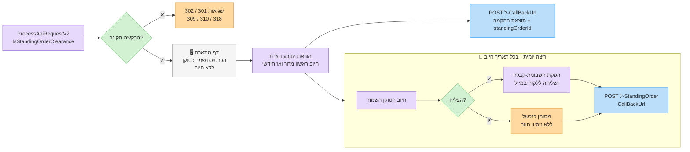

# ‫הוראות קבע (חיובים חוזרים)‬

‫**הוראת קבע** מחייבת את הכרטיס השמור של הלקוח באופן אוטומטי מדי חודש, למספר חודשים קבוע, ומפיקה חשבונית-קבלה על כל חיוב שהצליח. יוצרים אותה בקריאה אחת ל-[`ProcessApiRequestV2`](process-api-request-v2.md) — ומשם Invoice4U מריצה את לוח החיובים עבורכם.‬


‫**דרישות מקדימות:** חשבון סליקה פעיל שבו **גם** טוקנים **וגם** הוראות קבע מופעלים על המסוף. אחרת הבקשה נכשלת עם `ApiTokenizationNotApprovedInClearingTerminal` ‏(309) / `ApiStandingOrderNotApprovedInClearingTerminal` ‏(310). אם אחד הפיצ'רים מבוטל על המסוף בהמשך — החיובים המתוזמנים מדולגים.‬


## ‫מחזור החיים במבט אחד‬



1. ‫**הקמה** — השרת שלכם קורא ל-`ProcessApiRequestV2` עם `IsStandingOrderClearance: true` ומפנה את הלקוח ל-`ClearingRedirectUrl`. הדף המתארח **רק שומר את הכרטיס** (טוקן) — הלקוח **לא מחויב** בדף הזה.‬
2. ‫**יצירת הוראת הקבע** — Invoice4U יוצרת את הוראת הקבע ואת לוח החיובים החודשי, ושולחת פעם אחת הודעה ל-`CallBackUrl` שלכם (ה[קולבק הרגיל של הסליקה](process-api-request-v2.md), עם `standingOrderId` מלא).‬
3. ‫**חיובים חוזרים** — פעם ביום Invoice4U מחייבת כל הוראת קבע שתאריך החיוב שלה הוא היום, מפיקה מסמך ושולחת הודעה ל-`StandingOrderCallBackUrl` על כל ניסיון — הצלחה **או** כישלון.‬
4. ‫**סיום** — אחרי `StandingOrderDuration` תאריכי חיוב הוראת הקבע מסתיימת. חיובים שנכשלו לא מושלמים (ראו [חיובים שנכשלו](#failed-charges-no-automatic-retries)).‬

## ‫יצירת הוראת קבע‬

‫`POST /Services/ApiService.svc/ProcessApiRequestV2` עם [שדות הסליקה](process-api-request-v2.md) הרגילים, ובנוסף:‬

| ‫שדה‬ | ‫טיפוס‬ | ‫חובה‬ | ‫תיאור‬ |
| --- | ----- | ---- | ----- |
| `IsStandingOrderClearance` | boolean | ‫**כן**‬ | ‫מצב הוראת קבע. מפעיל דף שמירת כרטיס (טוקן). לא ניתן לשלב עם `AddTokenAndCharge` ‏(`ApiBadRequestChargeMethodMustBeSelected`, 319).‬ |
| `Sum` | double | ‫**כן**‬ | ‫הסכום **החודשי** (כולל מע"מ).‬ |
| `StandingOrderDuration` | int | ‫**כן**‬ | ‫מספר החיובים החודשיים, חייב להיות גדול מ-0 (`ApiStandingOrderDurationNotFilled`, 301). מקסימום 120.‬ |
| `DocHeadline` | string | ‫**כן**‬ | ‫נושא כל המסמכים החוזרים (`ApiStandingOrderDocSubjectNotFilled`, 302).‬ |
| `DocItemName` | string | ‫לא‬ | ‫שם שורת הפריט במסמכים החוזרים. ברירת מחדל: `DocHeadline`.‬ |
| `StandingOrderFirstChargeAmount` | double | ‫לא‬ | ‫סכום שונה לחיוב המתוזמן **הראשון** בלבד (למשל דמי הקמה או חודש ראשון בהנחה). החיובים הבאים לפי `Sum`.‬ |
| `StandingOrderCallBackUrl` | string | ‫מומלץ‬ | ‫ה-endpoint שלכם להודעות על **חיובים חוזרים**. חייב להיות URL אבסולוטי תקין (`ApiStandingOrderCallbackurlInvalid`, 318). לכתובת בלי scheme יתווסף `http://` (או `https://` כשהיא מתחילה ב-`www`). ראו [פורמט](#recurring-charge-callback-standingordercallbackurl).‬ |
| `CallBackUrl` | string | ‫מומלץ‬ | ‫ה-endpoint שלכם לתוצאת **ההקמה** החד-פעמית.‬ |
| `ReturnUrl` | string | ‫כן‬ | ‫לאן הדפדפן של הלקוח חוזר אחרי דף הכרטיס.‬ |
| `CustomerId` / `IsAutoCreateCustomer` | int / boolean | ‫מומלץ‬ | ‫קושר את הטוקן ואת הוראת הקבע לכרטיס לקוח אמיתי, כך שהמסמכים יופקו ללקוח הזה וישלחו אליו במייל.‬ |
| `FullName` / `Phone` / `Email` | string | ‫**כן** (בלי `CustomerId`)‬ | ‫פרטי המשלם, כמו בכל בקשת דף מתארח.‬ |
| `CreditCardCompanyType` | int | ‫**כן**‬ | ‫חברת הסליקה שלכם (`6` UPay, ‏`7` משולם, ‏`12` יעד שריג, ‏`15` קארדקום).‬ |


‫**אל תשלחו** `Type` = 2/3 או `PaymentsNum` גדול מ-1 עם הוראת קבע — תשלומים הופכים את דף שמירת הכרטיס לדף חיוב. `Currency` מתעלמים ממנו: הוראות קבע שנוצרות דרך ה-API מחויבות תמיד ב-**ש"ח**. אין צורך ב-`IsDocCreate` — מסמך מופק תמיד על כל חיוב חוזר שהצליח.‬


### ‫דוגמת בקשה‬

```http
POST /Services/ApiService.svc/ProcessApiRequestV2 HTTP/1.1
Host: apiqa.invoice4u.co.il
Content-Type: application/json

{
  "request": {
    "Invoice4UUserApiKey": "d2f1a6b3-1234-4c9a-9f00-1a2b3c4d5e6f",
    "CreditCardCompanyType": 7,
    "IsStandingOrderClearance": true,
    "Sum": 99.0,
    "StandingOrderDuration": 12,
    "StandingOrderFirstChargeAmount": 49.0,
    "DocHeadline": "Pro plan subscription",
    "DocItemName": "Pro plan - monthly",
    "CustomerId": 88231,
    "FullName": "Israel Israeli",
    "Phone": "0501234567",
    "Email": "israel@example.com",
    "OrderIdClientUsage": "sub-10045",
    "ReturnUrl": "https://shop.example/subscribed",
    "CallBackUrl": "https://shop.example/api/i4u-callback",
    "StandingOrderCallBackUrl": "https://shop.example/api/i4u-recurring",
    "IsQaMode": true
  }
}
```

‫התשובה זהה לכל בקשת דף מתארח — בדקו את `Errors` ואז הפנו את הלקוח ל-`ClearingRedirectUrl`:‬

```json
{
  "ProcessApiRequestV2Result": {
    "Sum": 99.0,
    "OrderIdClientUsage": "sub-10045",
    "ClearingRedirectUrl": "https://pay.example-provider.co.il/page/abc123",
    "Errors": []
  }
}
```

## ‫לוח החיובים‬

| ‫כלל‬ | ‫התנהגות‬ |
| --- | ------- |
| ‫חיוב ראשון‬ | ‫**למחרת** היום שבו הלקוח השלים את דף הכרטיס. ביום ההרשמה לא מתבצע חיוב.‬ |
| ‫חיובים הבאים‬ | ‫חודשי, באותו יום בחודש כמו החיוב הראשון.‬ |
| ‫חודשים קצרים‬ | ‫חיוב ראשון ב-29–31 ייפול ביום האחרון של חודשים קצרים יותר (למשל 31 ינו' ← 28 פבר' ← 31 מרץ ← 30 אפר').‬ |
| ‫מספר חיובים‬ | ‫בדיוק `StandingOrderDuration` תאריכי חיוב (מקסימום 120).‬ |
| ‫שעה ביום‬ | ‫החיובים רצים באצווה **יומית** אחת בתאריך החיוב. השעה המדויקת לא מובטחת — אל תסתמכו עליה.‬ |

‫דוגמה: לקוח משלים את דף הכרטיס ב-**15 במרץ 2026** עם `StandingOrderDuration: 12` ← חיובים ב-16 במרץ 2026, 16 באפריל, 16 במאי … 16 בפברואר 2027.‬

## ‫סכומים‬

* ‫**חיוב ראשון:** `StandingOrderFirstChargeAmount` כשהוא נשלח ושונה מ-`Sum`; אחרת `Sum`.‬
* ‫**כל שאר החיובים:** `Sum`.‬
* ‫הסכומים כוללים מע"מ. המע"מ במסמך מחושב לפי שיעור המע"מ של הארגון שלכם.‬

## ‫מה קורה בכל חיוב‬

‫בכל תאריך חיוב Invoice4U:‬

1. ‫מחייבת את הטוקן השמור **הנוכחי** של הלקוח של הוראת הקבע (ראו [החלפת כרטיס](#replacing-the-card)).‬
2. ‫בהצלחה — מפיקה **חשבונית-קבלה**: נושא = `DocHeadline`, שורת פריט אחת (`DocItemName` או `DocHeadline`) בסכום שחויב, ושורת תשלום באשראי עם ספרות הכרטיס.‬
3. ‫שולחת את המסמך במייל לכתובות המייל שבכרטיס הלקוח. בעל החשבון לא מקבל עותק של כל מסמך כברירת מחדל (ניתן לשנות זאת לכל הוראת קבע באפליקציית Invoice4U).‬
4. ‫רושמת את החיוב (הצלחה או כישלון) בהיסטוריית החיובים של הוראת הקבע.‬
5. ‫שולחת את [קולבק החיוב החוזר](#recurring-charge-callback-standingordercallbackurl) ל-`StandingOrderCallBackUrl`, אם הוגדר.‬

‫אחרי הריצה היומית בעל החשבון מקבל גם **מייל סיכום** עם החיובים של אותו יום ותוצאותיהם.‬


‫כל מסמך שהוראת קבע מפיקה נושא `ApiIdentifier` = `SO_<standingOrderId>`. המזהה זהה לכל החיובים של אותה הוראת קבע, לכן כדי למצוא מסמך של חודש מסוים השתמשו ב[חיפוש מסמכים](../documents/search-documents.md) (לפי לקוח ותאריך).‬


## ‫קולבקים — איזה, מתי ומה‬

‫הוראת קבע משתמשת ב**שני קולבקים שונים** ב**פורמטים שונים**:‬

| | ‫קולבק הקמה‬ | ‫קולבק חיוב חוזר‬ |
| - | ---------- | --------------- |
| **URL** | `CallBackUrl` | `StandingOrderCallBackUrl` |
| ‫**מתי**‬ | ‫פעם אחת, אחרי השלמת דף הכרטיס ויצירת הוראת הקבע‬ | ‫אחרי **כל** ניסיון חיוב מתוזמן — הצלחה או כישלון‬ |
| ‫**כמה פעמים**‬ | ‫1 לכל הוראת קבע‬ | ‫עד `StandingOrderDuration` פעמים (אחת לכל תאריך חיוב)‬ |
| **Method / Content-Type** | `POST`, `application/x-www-form-urlencoded` | ‫`POST`, `application/x-www-form-urlencoded` (רק הכותרת — ראו בהמשך)‬ |
| ‫**גוף**‬ | ‫שדה טופס `Data` = JSON (מפתחות PascalCase)‬ | ‫**מחרוזת Base64 גולמית** של אובייקט JSON (מפתחות camelCase) — בלי שם שדה‬ |
| ‫**מזהה את הוראת הקבע לפי**‬ | `standingOrderId` | `standingOrderId` |
| ‫**כולל פרטי מסמך**‬ | ‫לא (בהקמה לא מופק מסמך)‬ | ‫רק `isSuccessDocCreation` — בלי מספר או מזהה מסמך‬ |
| ‫**כולל `PaymentId` / `OrderIdClientUsage`**‬ | ‫כן (`OrderIdClientUsage` מהבקשה שלכם)‬ | ‫לא‬ |


‫שמרו את **`standingOrderId`** מקולבק ההקמה ברשומת המנוי שלכם. זה הקישור היחיד בין קולבקי החיוב החוזר למערכת שלכם — `OrderIdClientUsage` **לא** חוזר בקולבקי החיוב החוזר.‬


### ‫קולבק הקמה (`CallBackUrl`)‬

‫נשלח פעם אחת, כשהוראת הקבע נוצרת. הוא בפורמט [קולבק הסליקה הרגיל](process-api-request-v2.md): שדה טופס בשם `Data` שמכיל JSON, כל הערכים מחרוזות. בהוראת קבע:‬

* ‫`standingOrderId` — מזהה הוראת הקבע החדשה. **שמרו אותו.**‬
* ‫`Amount` — ה-`Sum` החודשי.‬
* ‫`DocCreated` — `"False"`; בהקמה לא מופק מסמך.‬
* ‫`CardSuffix` / `CardExpirationDate` / `CardBrandName` — הכרטיס שנשמר.‬

```text
POST /api/i4u-callback HTTP/1.1
Host: shop.example
Content-Type: application/x-www-form-urlencoded

Data={
  "Success": "True",
  "TokenCaptureOnly": "False",
  "TokenCaptureAndCharge": "False",
  "ErrorMessage": "",
  "OrderIdClientUsage": "sub-10045",
  "DocCreated": "False",
  "CardSuffix": "1234",
  "CardExpirationDate": "0828",
  "CardBrandName": "Visa",
  "UniqueId": "012345678",
  "Amount": "99",
  "AllPaymentsNum": "1",
  "CustomerId": "88231",
  "CustomerName": "Israel Israeli",
  "CustomerMail": "israel@example.com",
  "CustomerPhone": "0501234567",
  "Description": "",
  "AuthNumber": "",
  "PaymentId": "",
  "ClearingTraceId": "a1b2c3d4-0000-4000-8000-000000000002",
  "standingOrderId": "150877"
}
```

‫אם דף הכרטיס נכשל או שלא ניתן היה ליצור את הוראת הקבע — `standingOrderId` ריק (או שקולבק ההקמה לא מגיע כלל). התייחסו להרשמה כ**לא** הושלמה.‬

### ‫קולבק חיוב חוזר (`StandingOrderCallBackUrl`)‬ {#recurring-charge-callback-standingordercallbackurl}

‫נשלח אחרי כל ניסיון חיוב מתוזמן, אחרי שלב המסמך. גוף הבקשה **אינו** שדה טופס **ואינו** JSON: הוא קידוד Base64 של אובייקט JSON ב-UTF-8, שנשלח כגוף גולמי.‬

```http
POST /api/i4u-recurring HTTP/1.1
Host: shop.example
Content-Type: application/x-www-form-urlencoded

ew0KICAic3VtIjogIjk5IiwNCiAgInBheW1lbnRzTnVtIjogIjk5IiwNCiAgIm93bmVySWQiOiAiMDEyMzQ1Njc4IiwNCiAgImNhcmRTdWZmaXgiOiAiMTIzNCIsDQogICJjYXJkRXhwRGF0ZSI6ICIwODI4IiwNCiAgImNsaWVudE5hbWUiOiAiSXNyYWVsIElzcmFlbGkiLA0KICAiY2xpZW50UGhvbmUiOiAiMDUwMTIzNDU2NyIsDQogICJjbGllbnRFbWFpbCI6ICJpc3JhZWxAZXhhbXBsZS5jb20iLA0KICAic3RhbmRpbmdPcmRlcklkIjogIjE1MDg3NyIsDQogICJpc1N1Y2Nlc3NDbGVhcmluZyI6ICJ0cnVlIiwNCiAgImlzU3VjY2Vzc0RvY0NyZWF0aW9uIjogInRydWUiLA0KICAiZmFpbHVyZUNsZWFyaW5nTWVzc2FnZSI6ICIiLA0KICAiZmFpbHVyZURvY0NyZWF0aW9uTWVzc2FnZSI6ICIiDQp9
```

‫אחרי פענוח:‬

```json
{
  "sum": "99",
  "paymentsNum": "99",
  "ownerId": "012345678",
  "cardSuffix": "1234",
  "cardExpDate": "0828",
  "clientName": "Israel Israeli",
  "clientPhone": "0501234567",
  "clientEmail": "israel@example.com",
  "standingOrderId": "150877",
  "isSuccessClearing": "true",
  "isSuccessDocCreation": "true",
  "failureClearingMessage": "",
  "failureDocCreationMessage": ""
}
```

‫חיוב שנכשל נראה אותו דבר, עם `isSuccessClearing: "false"`, ‏`isSuccessDocCreation: "false"` והסיבות בשני שדות ההודעה:‬

```json
{
  "sum": "99",
  "paymentsNum": "99",
  "ownerId": "012345678",
  "cardSuffix": "1234",
  "cardExpDate": "0828",
  "clientName": "Israel Israeli",
  "clientPhone": "0501234567",
  "clientEmail": "israel@example.com",
  "standingOrderId": "150877",
  "isSuccessClearing": "false",
  "isSuccessDocCreation": "false",
  "failureClearingMessage": "<decline reason from the clearing company>",
  "failureDocCreationMessage": "המסמך לא הופק עקב כישלון בסליקה"
}
```

| ‫שדה‬ | ‫משמעות‬ |
| --- | ------ |
| `standingOrderId` | ‫הוראת הקבע שהחיוב שייך אליה — התאימו למזהה ששמרתם מקולבק ההקמה.‬ |
| `isSuccessClearing` | ‫`"true"` כשהכרטיס חויב. זה השדה שקובע אם החודש שולם.‬ |
| `isSuccessDocCreation` | ‫`"true"` כשחשבונית-הקבלה הופקה. יכול להיות `"false"` גם אחרי חיוב מוצלח — הכסף נגבה אבל המסמך דורש טיפול (ראו `failureDocCreationMessage`).‬ |
| `failureClearingMessage` | ‫סיבת הדחייה / השגיאה כש-`isSuccessClearing` הוא `"false"`. טקסט חופשי מחברת הסליקה או מ-Invoice4U — לרוב **בעברית**; שמרו אותו בלוג, אל תפענחו אותו.‬ |
| `failureDocCreationMessage` | ‫הסיבה שהמסמך לא הופק. טקסט חופשי, לרוב בעברית.‬ |
| `sum` | ‫הסכום החודשי הרגיל של הוראת הקבע (`Sum`). בחיוב הראשון עם `StandingOrderFirstChargeAmount` הסכום שחויב בפועל שונה מהערך הזה.‬ |
| `paymentsNum` | ‫כרגע מכיל את אותו ערך כמו `sum` — אל תסתמכו עליו. כל חיוב מתוזמן הוא תשלום אחד.‬ |
| `ownerId` | ‫ת"ז בעל הכרטיס, כפי שנשמרה עם הטוקן.‬ |
| `cardSuffix` / `cardExpDate` | ‫ספרות הכרטיס השמור ותוקפו, כפי שנשמרו עם הטוקן (תוקף בדרך כלל `MMYY`).‬ |
| `clientName` / `clientPhone` / `clientEmail` | ‫הפרטים הנוכחיים בכרטיס הלקוח.‬ |

‫כל הערכים מחרוזות. הקולבק **לא** כולל את תאריך החיוב, את הסכום שחויב בחיוב הראשון, `PaymentId` או מספר מסמך — השתמשו ביום הקבלה כתאריך החיוב, ומצאו מסמכים עם [חיפוש מסמכים](../documents/search-documents.md).‬

#### ‫קריאת הגוף‬

‫קראו את **גוף הבקשה הגולמי** ופענחו אותו מ-Base64. אל תתנו ל-parser של טפסים לקרוא אותו: Base64 יכול להכיל `+`, `/` ו-`=`, ופענוח טופס הופך `+` לרווח ומשבש את התוכן.‬



```javascript
app.post('/api/i4u-recurring', express.text({ type: '*/*' }), (req, res) => {
  const evt = JSON.parse(Buffer.from(req.body.trim(), 'base64').toString('utf8'));

  if (evt.isSuccessClearing === 'true') {
    markMonthPaid(evt.standingOrderId);
  } else {
    handleFailedCharge(evt.standingOrderId, evt.failureClearingMessage);
  }
  res.sendStatus(200);
});
```



```php
<?php
$raw = trim(file_get_contents('php://input'));   // not $_POST
$evt = json_decode(base64_decode($raw), true);

if ($evt['isSuccessClearing'] === 'true') {
    markMonthPaid($evt['standingOrderId']);
} else {
    handleFailedCharge($evt['standingOrderId'], $evt['failureClearingMessage']);
}
http_response_code(200);
```



```csharp
app.MapPost("/api/i4u-recurring", async (HttpRequest req) =>
{
    using var reader = new StreamReader(req.Body);
    var raw = (await reader.ReadToEndAsync()).Trim();
    var json = Encoding.UTF8.GetString(Convert.FromBase64String(raw));
    var evt = JsonSerializer.Deserialize<Dictionary<string, string>>(json)!;

    if (evt["isSuccessClearing"] == "true") MarkMonthPaid(evt["standingOrderId"]);
    else HandleFailedCharge(evt["standingOrderId"], evt["failureClearingMessage"]);

    return Results.Ok();
});
```



‫לבדיקת ה-endpoint שלכם, שלחו את גוף הדוגמה:‬

```bash
curl -X POST "https://shop.example/api/i4u-recurring" \
  -H "Content-Type: application/x-www-form-urlencoded" \
  --data-binary "ew0KICAic3VtIjogIjk5IiwNCiAgInBheW1lbnRzTnVtIjogIjk5IiwNCiAgIm93bmVySWQiOiAiMDEyMzQ1Njc4IiwNCiAgImNhcmRTdWZmaXgiOiAiMTIzNCIsDQogICJjYXJkRXhwRGF0ZSI6ICIwODI4IiwNCiAgImNsaWVudE5hbWUiOiAiSXNyYWVsIElzcmFlbGkiLA0KICAiY2xpZW50UGhvbmUiOiAiMDUwMTIzNDU2NyIsDQogICJjbGllbnRFbWFpbCI6ICJpc3JhZWxAZXhhbXBsZS5jb20iLA0KICAic3RhbmRpbmdPcmRlcklkIjogIjE1MDg3NyIsDQogICJpc1N1Y2Nlc3NDbGVhcmluZyI6ICJ0cnVlIiwNCiAgImlzU3VjY2Vzc0RvY0NyZWF0aW9uIjogInRydWUiLA0KICAiZmFpbHVyZUNsZWFyaW5nTWVzc2FnZSI6ICIiLA0KICAiZmFpbHVyZURvY0NyZWF0aW9uTWVzc2FnZSI6ICIiDQp9"
```

#### ‫כללי שליחה‬

* ‫**ניסיון אחד, בלי ניסיונות חוזרים.** הקולבק נשלח פעם אחת לכל ניסיון חיוב. אם ה-endpoint שלכם לא זמין או מחזיר שגיאה — ההודעה אובדת. גוף התשובה וקוד הסטטוס שלכם לא נבדקים.‬
* ‫**ה-query string לא נשלח.** הקולבק נשלח רק ל-scheme, ל-host ול-path של `StandingOrderCallBackUrl` — פרמטרים כמו `?tenant=42` **לא** נשלחים. שימו את מה שדרוש לניתוב ב**נתיב** (למשל `/api/i4u-recurring/42`).‬
* ‫**ללא חתימה.** אין חתימה או סוד. התייחסו לקולבק כהודעה: בדקו את `standingOrderId` מול הרשומות שלכם, והשתמשו בנתיב שקשה לנחש.‬
* ‫**אידמפוטנטיות.** בססו את העיבוד על `standingOrderId` + תאריך הקבלה, כדי ששליחה כפולה לא תספור חודש פעמיים.‬
* ‫**לא נשלח** כשאין כלל כרטיס שמור ללקוח של הוראת הקבע — ודאו שהטוקן לא נמחק כל עוד הוראת הקבע פעילה.‬
* ‫**TLS:** ‏endpoints ב-HTTPS חייבים לתמוך ב-TLS 1.2.‬

## ‫חיובים שנכשלו (ללא ניסיונות חוזרים)‬ {#failed-charges-no-automatic-retries}


‫**חיוב חוזר שנכשל לא מנוסה שוב.** כשחיוב נדחה (או שאין כרטיס שמור), החודש נרשם ככושל, קולבק החיוב החוזר נשלח עם `isSuccessClearing: "false"`, ו**לא קורה שום דבר נוסף לגבי החודש הזה**. הוראת הקבע נשארת פעילה, והחיוב של החודש **הבא** רץ כמתוכנן.‬


‫מה זה אומר לאינטגרציה שלכם:‬

* ‫`isSuccessClearing: "false"` הוא סופי לאותו חודש — אל תחכו לקולבק הצלחה מאוחר יותר.‬
* ‫כדי לגבות את הסכום שהוחמץ, צרו קשר עם הלקוח ואז:‬
  * ‫קלטו כרטיס חדש עם [`AddToken`](tokens-and-standing-orders.md) לאותו `CustomerId` (זה גם מעדכן את הכרטיס לחודשים הבאים — ראו בהמשך), ואז חייבו את הסכום שהוחמץ עם [`ChargeWithToken`](tokens-and-standing-orders.md) ו-`IsDocCreate: true`; או‬
  * ‫חייבו דרך [בקשת דף מתארח](process-api-request-v2.md) רגילה.‬
* ‫חיובים שאתם מבצעים כך **לא** מקושרים להוראת הקבע: הם לא משנים את היסטוריית החיובים שלה ולא שולחים קולבק חיוב חוזר.‬
* ‫בעל החשבון יכול גם להריץ מחדש ידנית חיוב שנכשל מתוך היסטוריית החיובים של הוראת הקבע באפליקציית Invoice4U.‬

## ‫החלפת כרטיס‬ {#replacing-the-card}

‫ללקוח יש לכל היותר טוקן שמור אחד. שמירת כרטיס חדש עם [`AddToken`](tokens-and-standing-orders.md) לאותו `CustomerId` **מחליפה** את הטוקן, וכל החיובים **העתידיים** של הוראות הקבע של הלקוח משתמשים בכרטיס החדש אוטומטית — אין צורך ליצור מחדש את הוראת הקבע.‬

## ‫ניהול וביטול‬

‫ה-API הציבורי יוצר הוראות קבע, אבל לא חושף פעולות עדכון או ביטול. כדי להשהות, לבטל, לשנות סכום או תאריכים, או לצפות בהיסטוריית החיובים של הוראת קבע — השתמשו במסך הוראות הקבע באפליקציית Invoice4U. הוראות קבע מושבתות או מחוקות לא מחויבות.‬

## ‫הערות לפי חברת סליקה‬

‫ההתנהגות בעמוד הזה חלה על הוראות קבע שנוצרו דרך ה-API במסופי **קארדקום** ו**משולם**. במסופי **UPay** ו**יעד שריג** — אמתו את קולבקי ההקמה והחיוב החוזר ב-QA ‏(`IsQaMode: true`) לפני עלייה לאוויר.‬

## ‫שאלות נפוצות‬

‫**האם הלקוח מחויב כשהוא מזין את הכרטיס?**‬
‫לא. דף ההרשמה רק שומר את הכרטיס. החיוב הראשון רץ בריצה היומית של למחרת.‬

‫**אפשר לגבות את התשלום הראשון מיד בהרשמה?**‬
‫לא בדף הוראת הקבע — לא ניתן לשלב את `AddTokenAndCharge` עם `IsStandingOrderClearance`. החיוב המתוזמן הראשון תמיד רץ למחרת.‬

‫**איך יודעים שחודש שולם?**‬
‫מקולבק החיוב החוזר (`isSuccessClearing`), ממסמכי הלקוח ([חיפוש מסמכים](../documents/search-documents.md)), או מ[לוגי הסליקה](clearing-logs.md) שלכם.‬

‫**לא קיבלתי קולבק חיוב חוזר.**‬
‫בדקו ש-`StandingOrderCallBackUrl` הוגדר, שה-endpoint היה זמין (אין ניסיון חוזר), ושהוא לא תלוי בפרמטרים ב-query string. אחר כך בדקו את מסמכי הלקוח או את היסטוריית החיובים באפליקציה.‬

‫**למה הודעת הדחייה בעברית?**‬
‫הודעות הדחייה והמסמך הן טקסט חופשי מחברת הסליקה או מ-Invoice4U. שמרו אותן בלוג לצורכי תמיכה; בססו את הלוגיקה רק על `isSuccessClearing` / `isSuccessDocCreation`.‬

‫**הוראת קבע יכולה לרוץ לנצח?**‬
‫לא. `StandingOrderDuration` חייב להיות בין 1 ל-120 חיובים חודשיים. כדי להמשיך אחרי הסיום — צרו הוראת קבע חדשה.‬

## ‫שגיאות‬

| ‫שגיאה (ID)‬ | ‫משמעות‬ |
| ---------- | ------ |
| `ApiStandingOrderDurationNotFilled` (301) | ‫`StandingOrderDuration` חסר או קטן/שווה ל-0.‬ |
| `ApiStandingOrderDocSubjectNotFilled` (302) | ‫`DocHeadline` חסר.‬ |
| `ApiStandingOrderCallbackurlInvalid` (318) | ‫`StandingOrderCallBackUrl` אינו URL תקין.‬ |
| `ApiStandingOrderNotApprovedInClearingTerminal` (310) | ‫הוראות קבע לא מופעלות (או שתוקפן פג) על המסוף.‬ |
| `ApiTokenizationNotApprovedInClearingTerminal` (309) | ‫טוקנים לא מופעלים על המסוף.‬ |
| `ApiBadRequestChargeMethodMustBeSelected` (319) | ‫דגלים סותרים, למשל `AddTokenAndCharge` + `IsStandingOrderClearance`.‬ |
