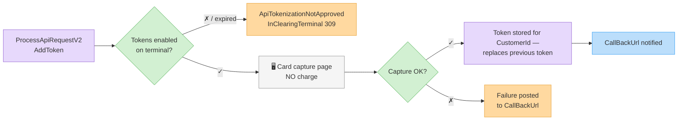
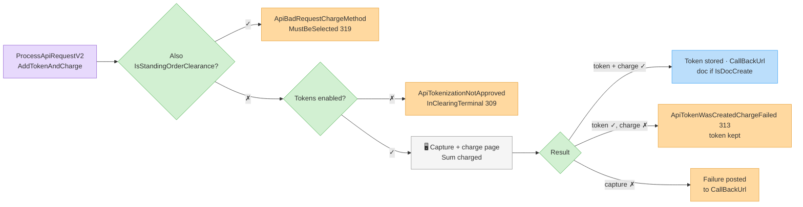
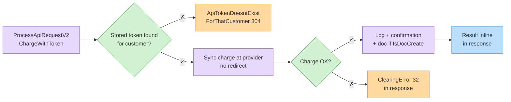

# ‫טוקנים (כרטיסים שמורים)‬

‫שמרו את כרטיס הלקוח כ**טוקן** וחייבו אותו מאוחר יותר, שרת-לשרת. כל התהליכים עוברים דרך [`ProcessApiRequestV2`](process-api-request-v2.md) עם הדגלים שלהלן. לחיובים חודשיים חוזרים, ראו [הוראות קבע (חיובים חוזרים)](standing-orders.md).‬


‫הטוקניזציה חייבת להיות מופעלת על מסוף הסליקה שלכם. אחרת תקבלו `ApiTokenizationNotApprovedInClearingTerminal` ‏(309).‬


## ‫שמירת טוקן — `AddToken`‬

‫פותח דף מתארח שקולט את הכרטיס ושומר טוקן, **ללא חיוב**. במשולם ובקארדקום, ניסיון לכידה כושל עשוי להחזיר `ApiChargeAttemptPhoneInvalid` ‏(314) — בדקו את מספר הטלפון של הלקוח ונסו שוב.‬

```json
{
  "request": {
    "Invoice4UUserApiKey": "<api-key>",
    "AddToken": true,
    "FullName": "Israel Israeli",
    "Phone": "0501234567",
    "Email": "israel@example.com",
    "CustomerId": 88231,
    "ReturnUrl": "https://shop.example/card-saved",
    "CallBackUrl": "https://shop.example/api/i4u-callback"
  }
}
```

‫הפנו את הלקוח ל-`ClearingRedirectUrl` המוחזר. הטוקן נשמר כנגד הלקוח (מומלץ `CustomerId` כדי שהטוקן יהיה שליף בהמשך).‬



## ‫שמירה + חיוב — `AddTokenAndCharge`‬

‫זהה לקודם אך גם מחייב את `Sum` מיידית. לא ניתן לשלב עם `IsStandingOrderClearance` ‏(`ApiBadRequestChargeMethodMustBeSelected`, 319). במשולם ובקארדקום, ניסיון לכידה כושל עשוי להחזיר `ApiChargeAttemptPhoneInvalid` ‏(314) — בדקו את מספר הטלפון של הלקוח ונסו שוב.‬



## ‫חיוב טוקן שמור — `ChargeWithToken`‬

‫שרת-לשרת, סינכרוני — ללא הפניה:‬

```json
{
  "request": {
    "Invoice4UUserApiKey": "<api-key>",
    "ChargeWithToken": true,
    "CustomerId": 88231,
    "Sum": 117.0,
    "Description": "Monthly subscription - July",
    "IsDocCreate": true,
    "DocHeadline": "Monthly subscription - July"
  }
}
```

‫הטוקן השמור של הלקוח מזוהה אוטומטית. `CustomerId` **חובה** — כל אינטגרציית ספק דורשת אותו כדי לאתר את הטוקן השמור, ולכן השמטתו נכשלת ללא שגיאת API נקייה. חייב להתקיים בדיוק טוקן אחד ללקוח — אחרת `ApiTokenDoesntExistForThatCustomer` ‏(304). בהצלחה, התשובה נושאת את האישור, ועם `IsDocCreate` — את שדות המסמך שנוצר. אם הטוקן נוצר אך חיוב ההמשך נכשל: `ApiTokenWasCreatedChargeFailed` ‏(313).‬



## ‫קשור‬

* ‫**הוראות קבע** (`IsStandingOrderClearance`) גם הן שומרות את הכרטיס ומחייבות אותו מדי חודש — ראו [הוראות קבע (חיובים חוזרים)](standing-orders.md).‬

## ‫שגיאות‬

| ‫שגיאה (ID)‬ | ‫משמעות‬ |
| ---------- | ------- |
| `ApiTokenizationNotApprovedInClearingTerminal` (309) | ‫טוקנים לא מופעלים על המסוף (או שתוקף פיצ'ר הטוקן פג).‬ |
| `ApiTokenDoesntExistForThatCustomer` (304) | ‫אין טוקן שמור (או שיש כמה) עבור הלקוח.‬ |
| `ApiTokenWasCreatedChargeFailed` (313) | ‫הטוקן נשמר, החיוב נדחה.‬ |
| `ApiChargeAttemptPhoneInvalid` (314) | ‫`AddToken`/`AddTokenAndCharge` (משולם, קארדקום): דף לכידת הכרטיס המתארח נכשל, לרוב עקב מספר טלפון/פרטי לקוח שגויים.‬ |
| `ApiBadRequestChargeMethodMustBeSelected` (319) | ‫דגלי מצב סותרים.‬ |

## ‫נסו את זה‬



