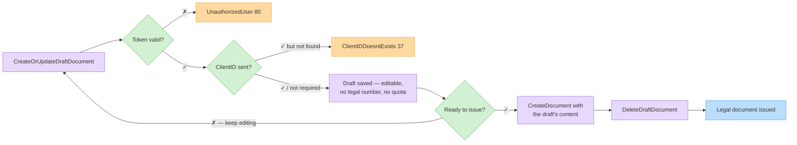

# טיוטות מסמכים

‫טיוטות הן מסמכים ניתנים לעריכה ולא סופיים: אין להן **מספר מסמך חוקי**, הן אינן צורכות ממכסת המסמכים שלכם, וניתן לעדכן או למחוק אותן בחופשיות. השתמשו בהן להכנת מסמך לפני הפקתו, או לשמירת מסמכים בתהליך מתוך הממשק שלכם.‬


‫אין מתודת "הפיכת טיוטה למסמך". כדי להפיק טיוטה: קראו אותה, העבירו את התוכן שלה ל[יצירת מסמך](create-document.md), ואז מחקו את הטיוטה.‬




## יצירה או עדכון — `CreateOrUpdateDraftDocument`

| | |
| - | - |
| ‫**מתודה**‬ | `POST` |
| ‫**נתיב**‬ | `/CreateOrUpdateDraftDocument` |
| ‫**גוף**‬ | `{ "doc": { ... }, "token": "<token>" }` |
| ‫**תשובה**‬ | ‫הטיוטה שנשמרה (`Document` עם `ID` מסוג GUID)‬ |

‫הבדלי התנהגות מול [יצירת מסמך](create-document.md):‬

* ‫**ולידציה מרוככת** — פריטים אופציונליים (הסכומים מאופסים בהיעדרם), תשלומים אופציונליים, אין בדיקות טווח תאריכים או מכסה.‬
* ‫הלקוח נבדק **רק אם נשלח `ClientID`** (`ClientIDDoesntExists`, 37); טיוטות הפקדה מדלגות על בדיקת לקוח לגמרי.‬
* ‫שליחת `ID` של טיוטה קיימת **מעדכנת** אותה.‬
* ‫`IsPreviewDocument: true` מכוון למשבצת **מסמך התצוגה המקדימה** היחידה של הארגון (upsert) — ראו [`GetPreviewDocumentByToken`](#getpreviewdocumentbytoken).‬

```http
POST /Services/ApiService.svc/CreateOrUpdateDraftDocument HTTP/1.1
Host: apiqa.invoice4u.co.il
Content-Type: application/json

{
  "doc": {
    "DocumentType": 1,
    "Subject": "Draft for order #10052",
    "ClientID": 88231,
    "Items": [
      { "Name": "Widget", "Quantity": 2, "Price": 50.0 }
    ]
  },
  "token": "<token>"
}
```

## שליפת טיוטה — `GetDraftDocument`

```json
{ "docId": "7f6a2c1e-8b4d-4f2a-9c3e-0d1e2f3a4b5c", "token": "<token>" }
```

‫`POST /GetDraftDocument` — מחזיר את הטיוטה (`Document`); `null` על GUID לא תקין.‬

## חיפוש — `GetDraftDocuments`

```json
{ "dr": { "DocumentType": 1 }, "token": "<token>" }
```

‫`POST /GetDraftDocuments` — אותם פילטרים של `DocumentsRequest` כמו ב[חיפוש מסמכים](search-documents.md); מחזיר `CommonCollection<Document[]>` של טיוטות.‬

## בדיקת קיום — `CheckIfDraftExistsByDocumentType`

```json
{ "docType": 1, "token": "<token>" }
```

‫`POST /CheckIfDraftExistsByDocumentType` — מחזיר `true`/`false`; ‏`null` כאשר הטוקן לא תקין.‬

## מחיקה — `DeleteDraftDocument` / `DeleteDraftDocuments`

```json
{ "docId": "7f6a2c1e-8b4d-4f2a-9c3e-0d1e2f3a4b5c", "token": "<token>" }
```

‫`POST /DeleteDraftDocument` — טיוטה בודדת. וריאציית האצווה `POST /DeleteDraftDocuments` מקבלת `{ "docIds": ["...", "..."], "token": "..." }`.‬

## מסמך תצוגה מקדימה — `GetPreviewDocumentByToken` {#getpreviewdocumentbytoken}

```json
{ "token": "<token>" }
```

‫`POST /GetPreviewDocumentByToken` — מחזיר את מסמך התצוגה המקדימה של הארגון (זה שנשמר עם `IsPreviewDocument: true`). משבצת אחת לארגון.‬

## שגיאות

| ‫שגיאה (ID)‬ | ‫משמעות‬ |
| ---------- | ------- |
| `UnauthorizedUser` (80) | ‫טוקן לא תקין.‬ |
| `ClientIDDoesntExists` (37) | ‫נשלח `ClientID` אך אין לקוח כזה.‬ |
| `ServerErrorOnDocumentCreate` (11) | ‫לא ניתן היה לשמור את הטיוטה.‬ |
| `DraftDocumentDeleteError` (135) | ‫הטיוטה לא נמצאה / לא ניתן היה למחוק (פר `docId`).‬ |
| `GeneralError` (0) | ‫שגיאת שרת.‬ |

## נסו את זה






