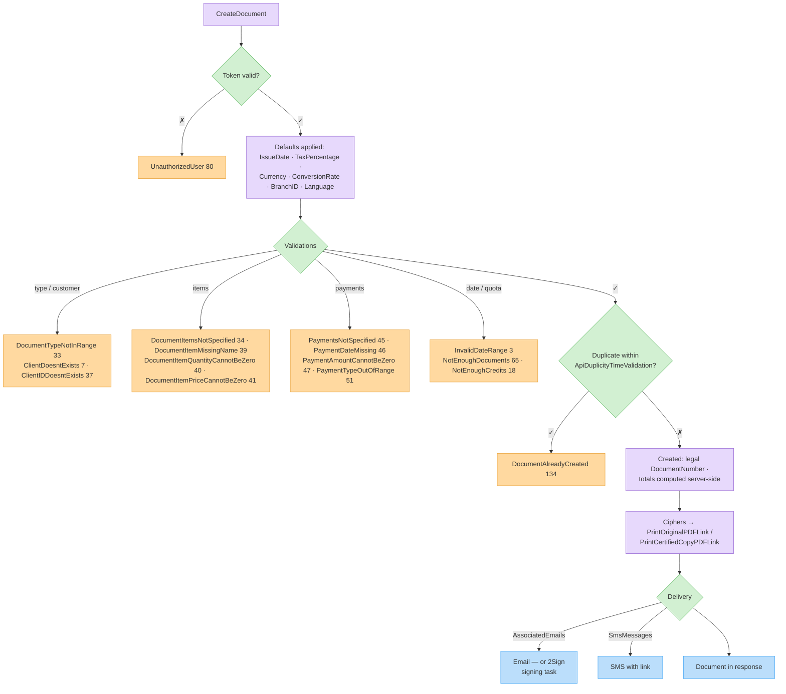

# ‫סקירת מתודות מסמכים‬

‫מסמכים הם הליבה של ה-API של Invoice4U: חשבוניות, קבלות, חשבוניות מס קבלה, חשבוניות זיכוי, הצעות מחיר, הזמנות ועוד. מרגע היצירה, המסמך חתום, ממוספר וסופי מבחינה חוקית — לא ניתן לערוך אותו, רק לזכות או לבטל באמצעות מסמך המשך.‬

### ‫מתודות בסקשן הזה‬

| ‫מתודה‬ | ‫עמוד‬ |
| ----- | ---- |
| `CreateDocument` | ‫[יצירת מסמך](create-document.md)‬ |
| `CreateDocumentWithIdentifierValidation` | ‫[יצירה עם ולידציית מזהה](create-document-with-validation.md)‬ |
| `GetDocument`, `GetDocumentByNumber`, `GetDocumentByApiIdentifier`, `IsDocumentExistsByApiIdentifier` | ‫[שליפת מסמך בודד](get-document.md)‬ |
| `GetDocuments` | ‫[חיפוש מסמכים](search-documents.md)‬ |
| `SendDocumentByMail` | ‫[שליחת מסמך במייל](send-document-by-email.md)‬ |
| `GetCustomerReport` | ‫[דוח לקוח](customer-report.md)‬ |
| `CreateOrUpdateDraftDocument`, `GetDraftDocument`, `GetDraftDocuments`, `DeleteDraftDocument`, `DeleteDraftDocuments`, `CheckIfDraftExistsByDocumentType`, `GetPreviewDocumentByToken` | ‫[טיוטות מסמכים](draft-documents.md)‬ |
| `UserIsraelInvoicesStatus`, `FetchAllocationNumber`, `UpdateAllocationNumber` | ‫[מספרי הקצאה (רשות המסים)](allocation-numbers.md)‬ |

### ‫עמודי עזר‬

* ‫[סוגי מסמכים](document-types.md) — ה-enum של `DocumentType` ומה כל סוג דורש‬
* ‫[אובייקט המסמך](document-object.md) — תיעוד מלא של שדות `Document`, `DocumentItem`, `Payment`, `Discount` ואובייקטים קשורים‬

### ‫תהליך יצירה טיפוסי‬

1. ‫אימות ← טוקן.‬
2. ‫זיהוי הלקוח: `ClientID` קיים, או שליחת `GeneralCustomer` (מותר רק לחלק מהסוגים).‬
3. ‫בניית ה-`Document`: סוג, פריטים ו/או תשלומים, כתובות למשלוח.‬
4. `POST /CreateDocument`.
5. ‫בדיקת `Errors`; בהצלחה, השתמשו ב-`DocumentNumber`, `ID` ובשדות `PrintOriginalPDFLink` / `PrintCertifiedCopyPDFLink`.‬

### ‫צפייה במסמך (קישורי PDF)‬ {#viewing-the-document-pdf-links}

‫רק **יצירת מסמך** (`CreateDocument`, `CreateDocumentWithIdentifierValidation`, `CreateDocumentREST`) קובעת את `PrintOriginalPDFLink` ואת `PrintCertifiedCopyPDFLink` בתשובה שלה — כתובות URL חתומות מראש לתת-דומיין מציג המסמכים: ב-QA הכתובת מפנה ל-`newviewqa.invoice4u.co.il`, בפרודקשן ל-`newview.invoice4u.co.il`. כל שאר המתודות שמחזירות `Document` — [שליפת מסמך בודד](get-document.md), [חיפוש](search-documents.md) וטיוטות (‏[Draft Documents](draft-documents.md)) — משאירות את שני השדות `null`; הן נושאות רק את `CipherText` ואת `CipherTextOriginal`, אסימוני הצפן (מקודדים ב-Base64 וב-URL) שמהם בונים את הקישורים. בנו את הכתובת בעצמכם: `{baseViewUrl}/Views/PDF.aspx?cipher={CipherTextOriginal}` עבור ה**מקור**, ו-`{baseViewUrl}/Views/PDF.aspx?cipher={CipherText}` עבור ה**העתק הנאמן למקור**. זהו כל ה-Base64 שתקבלו — אין שדה עם בייטים גולמיים של ה-PDF המעובד, כך שקריאה לכתובת `PDF.aspx` נשארת הדרך היחידה לקבל את הקובץ.‬

### ‫הגנה מכפילויות‬

‫שני מנגנונים מונעים חיוב כפול כשהמערכת שלכם מבצעת ניסיונות חוזרים:‬

| ‫מנגנון‬ | ‫איך זה עובד‬ |
| ------ | ----------- |
| `ApiIdentifier` | ‫המזהה הייחודי שלכם למסמך. אם לא שלחתם, ה-API מייצר `I4U-APIGEN-<guid>`. עם [CreateDocumentWithIdentifierValidation](create-document-with-validation.md) הקריאה נדחית עם `DocumentAlreadyCreated` (134) אם מסמך עם אותו מזהה כבר קיים — המסמך הקיים מוחזר.‬ |
| `ApiDuplicityTimeValidation` | ‫חלון זמן ב**שניות** (ברירת מחדל `60`). אם מסמך זהה נוצר בתוך החלון, `CreateDocument` נכשל עם `DocumentAlreadyCreated` (134). הגדילו את הערך עבור תורי retry איטיים.‬ |

### ‫שליחה באימייל וב-SMS‬

* ‫`AssociatedEmails` על המסמך מפעיל משלוח המסמך באימייל בעת היצירה.‬
* ‫`SmsMessages` מפעיל משלוח SMS (דורש קרדיט SMS בחשבון).‬
* ‫`EmailCustomComment` מתאים אישית את ההערה בגוף האימייל.‬
